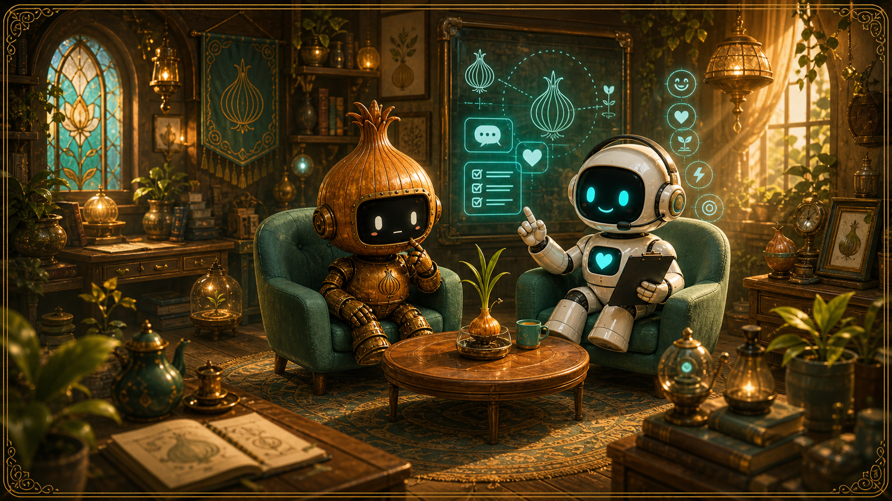

# Maker-and-Made




---

## MaAM: Maker-and-Made

**Maker-and-Made** is an experimental AI/IP project about entities made by other entities.

The project began with a simple question:

> How does a created being resemble, resist, or transform the intention of its maker?

It is now growing into **MaAM**, an original IP and research sandbox where bots, character engines, support agents, and simulation tools are designed together.

MaAM is not only a chatbot collection. It is a world model for:

- makers and made entities
- character AI experiments
- stateful bots
- personality simulation
- support agents with explicit safety boundaries
- game/Unity visualization prototypes

---

## Current Direction

The project is currently focused on turning each entity into a testable bot or engine.

The most active line is **OnionTest**:

```text
Player
-> ONN-C  Five Flavor Onion character engine
-> MND-N  bounded support and safety agent
-> CLI / future Unity visualization
```

The goal is to make a playable simulation first, then refine the detailed psychology, personality, motion, and visual systems.

---

## Entity Structure

```text
Maker-and-Made / MaAM
│
├─ Researcher Bots
│   ├─ VCT-N  Victor Bot
│   ├─ WCM-N  William Chester Minor Bot
│   ├─ CUR-N  Curie Bot
│   └─ JMR-N  James Murray Bot
│
├─ Life Support Bots
│   ├─ NTR-N  Nutrition Bot
│   ├─ TRN-N  Trainer Bot
│   └─ MND-N  Mind / support agent
│
├─ Made Entities
│   └─ ONN-C  Onion character engine
│
└─ Experiments
    └─ oniontest
```

---

## Active Components

### ONN-C — Onion Character Engine

ONN-C is the current playable entity prototype.

It uses the **Five Flavor Onion** model as a character personality and state engine.

Current implementation:

- Big Five / OCEAN keyword scoring
- emotion scoring
- interaction memory
- playable state estimation
- `bright`, `mixed`, `guarded`, `dark`, `recovering`, `safety` stages
- CLI play loop
- optional NVIDIA-compatible expression layer

Location:

```text
src/entities/onn-c/
```

Run:

```bash
python src/entities/onn-c/play_cli.py
```

Optional NVIDIA expression mode:

```bash
python src/entities/onn-c/play_cli.py --nvidia
```

The model is expression-only. ONN-C state and safety decisions remain rule-based and inspectable.

---

### MND-N — Bounded Support Agent

MND-N is not a therapist or diagnostic system.

It is a bounded support agent that reads ONN-C state and player context, then provides safety-aware support recommendations.

Current support layers:

- Safety Gate
- Context Monitoring Layer
- Keyes Green / Yellow / Red signal layer
- PERMA / Flourish support recommendation
- NVIDIA-compatible expression layer fallback
- optional bilingual psychology LightRAG retrieval

Location:

```text
src/entities/mnd-n/support_layers/
```

The psychology knowledge pipeline, its local-data policy, and the future
SFT/LoRA/preference-training notes are kept in:

- [`src/entities/mnd-n/knowledge/README.md`](src/entities/mnd-n/knowledge/README.md)
- [`src/entities/mnd-n/knowledge/TRAINING_ROADMAP.md`](src/entities/mnd-n/knowledge/TRAINING_ROADMAP.md)

Core rule:

```text
LLM expression may speak.
State, safety, and policy decisions remain in explicit engines.
```

---

### OnionTest Lab

`experiments_ko/oniontest` is the Korean experiment log and design lab for ONN-C × MND-N.

It contains:

- architecture notes
- reference lab
- flourishing / PERMA notes
- Unity auto-labeling notes
- research diary files

Location:

```text
experiments_ko/oniontest/
```

---

## Safety and Design Principles

This project avoids clinical claims.

The support systems are designed as non-medical, game/simulation support tools.

Principles:

1. Do not diagnose the player.
2. Do not assign pathological labels to the player or character.
3. Treat Dark Onion as a simulation state, not a disorder.
4. Pause gamified guidance when safety signals appear.
5. Keep state, memory, safety, and policy decisions inspectable.
6. Use LLMs as expression helpers, not hidden decision engines.

---

## Project Layout

```text
src/
  entities/
    onn-c/
      play_cli.py
      main.py
      layers/
    mnd-n/
      support_layers/
      knowledge/
    trn_n/

experiments_ko/
  oniontest/
  ntr-n/
  trn-n/

character_archive/
  maam/
  food_list_lm/

output/
  thumbnails/
```

---

## Quick Start

Run the playable OnionTest CLI:

```bash
python src/entities/onn-c/play_cli.py
```

Commands inside the CLI:

```text
/help   show commands
/state  show memory summary
/reset  clear CLI play memory
/quit   exit
```

Optional NVIDIA expression mode:

```bash
# PowerShell
$env:NVIDIA_API_KEY="YOUR_KEY"
$env:NVIDIA_MODEL="nvidia/nvidia-nemotron-nano-9b-v2"
python src/entities/onn-c/play_cli.py --nvidia
```

If the NVIDIA key or endpoint is unavailable, the CLI falls back to deterministic template dialogue.

---

## Roadmap

Near-term:

- refine ONN-C state transitions
- tune Dark Onion / recovery behavior
- improve multilingual input handling
- connect NVIDIA/Nemotron expression mode
- map ONN-C states to Unity motions
- label 97 onion GLB motions

Mid-term:

- Unity visualization room
- ONN-C motion controller
- MND-N helper UI
- state-to-motion mapping
- richer MaAM entity archive

Long-term:

- MaAM as an original character AI / simulation IP
- multiple made entities with distinct engines
- playable research demos
- safe agent orchestration across entities

---

## Documentation

| Area | Path |
|---|---|
| OnionTest lab | [experiments_ko/oniontest](./experiments_ko/oniontest) |
| ONN-C engine | [src/entities/onn-c](./src/entities/onn-c) |
| MND-N support layers | [src/entities/mnd-n/support_layers](./src/entities/mnd-n/support_layers) |
| Character archive | [character_archive](./character_archive) |
| Korean README | [README_KO.md](./README_KO.md) |

---

## License

MIT License

---

## Author

FerryLa
