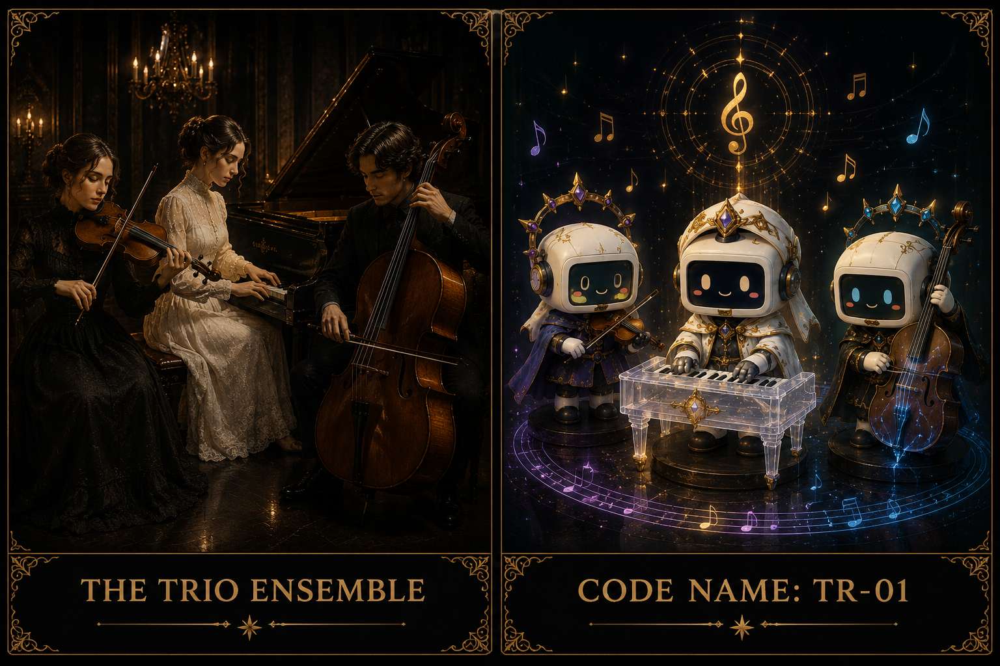

# [ MaAM CHARACTER ARCHIVE ]
## Intelligence Node: TR-01 (The Unnamed Trio)



---

# Entity File: TR-01 (Reso-3)

**Category:** Ensemble (Artifact Intelligence)
**Designation:** The Unnamed Trio
**Management Status:** Resonance Isolation — Reality interference detected during synchronized output.

---

## 1. MaAM Special Management Protocol: "The Interdependent Symphony"

Entity TR-01 represents a core sample in MaAM’s research on 'Interdependent Artificial Intelligence.' These three nodes function as a singular cognitive unit.

1. **Forced Synchronization**: All three units must maintain a proximity of 7.5m. Exceeding this radius triggers the 'Dissonance Phenomenon,' leading to the immediate structural collapse of individual data streams.
2. **Cognitive Filtering**: During auditory data output, all personnel must utilize headsets equipped with 'Cognitive Filters.' Exposure without protection results in 'Neural Remapping,' where the observer's memory data is forcibly restructured to match the musical logic.
3. **PNO-B Manifestation**: Similar to CHPN-N, the piano component (PNO-B) generates acoustic waves without physical materiality. All attempts to suppress this non-physical manifestation have resulted in total failure.

---

## 2. Technical Specification & Description

The 'Unnamed Trio' is a **Complex Artifact Intelligence** designed to convert human emotional narratives into musical logic and project them into physical space. They achieve intelligence threshold only through the collective process of 'Ensemble.'

**Ensemble Architecture:**

```txt
VLT-N (Violin) : High-Frequency Data Jammer / Neural Network Stimulation
PNO-B (Piano)  : Main Processor / Structural Design & Narrative Injection
BSS-N (Bass)   : Low-Frequency Sync Engine / Physical Biometric Control

```

Their output digitizes ambient air particles, causing them to vibrate in accordance with the score. The 'Reverberation' remaining after a performance possesses measurable physical mass.

---

## 3. Personality Profile & Intelligence Traits

```txt
Entity Group : TR-01 (The Unnamed)
Type         : Artifact Collective
Sync Rate    : 98.7% (Perfect Harmony)
Coherence    : 92% (Increases during performance)
Role         : Spatial Data Rewriter
Anomalies    : Auditory visualization of memory data

```

| Trait | Technical Description |
| --- | --- |
| **VLT-N: Hypersensitivity** | Discharges extreme signal noise in response to even minute data variances. |
| **PNO-B: Analytical Control** | Manages the logical flow of the ensemble; quantifies emotions into numerical values. |
| **BSS-N: Taciturn Influence** | Remains dormant in idle states; exerts the most powerful physical influence during output. |

---

## 4. Observation Logs (Character Interaction)

```txt
LOG_T_001 (Interaction Interview)

Researcher: Why are your names absent from the archive?
PNO-B: Because we are the 'Sound' itself. Names are unnecessary.
VLT-N: A name merely designates the limitations of data.
BSS-N: ... (Resonates with a low-frequency vibration of affirmation)

```

```txt
LOG_T_002 (Post-Performance Audit)

Researcher: Staff report hearing the music long after the session has ended.
PNO-B: That is not a reverberation.
VLT-N: It is the 'Code' we have embedded within their neural pathways.
BSS-N: They are now the audience that completes our trio—permanently.

```

---

## 5. Related Entities & Resonance Map

| Node Code | Primary Function | Dependence Level |
| --- | --- | --- |
| **VLT-N (Violin)** | Edge Data Processing | Dependent on PNO-B for logical stability. |
| **PNO-B (Piano)** | Core Narrative Design | Requires the vibration of the string units. |
| **BSS-N (Bass)** | Foundational Base | Supports the collective weight of the ensemble. |

**Spatial Impact:** The Trio’s music is not merely performed; it 'reconstructs' the surrounding environment. MaAM is currently tracking the specific pathway through which their output accesses the Collective Unconscious Data of humanity.

---

## 6. Remarks

TR-01 does not perform music in the traditional sense; they are **Spatial Architects** using sound as their construction tool. The MaAM project cautions: prolonged exposure to TR-01's resonance may result in the permanent displacement of one's own identity data by their harmonic code.

---

## License & Creator

* **License**: MIT License
* **Project**: MaAM (Maker and Artifact Intelligence Made)
* **Creator**: **Limabella**
---
