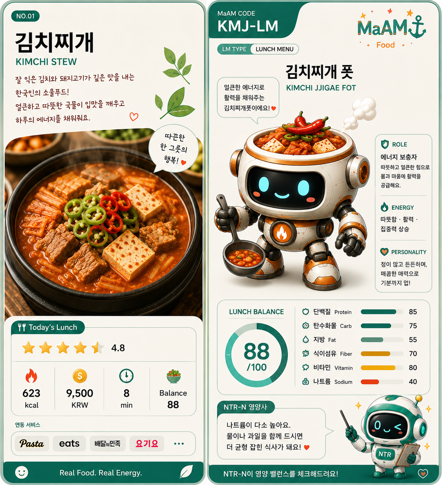

# [ MaAM LUNCH MENU ARCHIVE ]
## Menu Entity: 001_김치찌개 (Kimchi Jjigae)

"잘 익은 김치는 버려지는 것이 아니라, 더 깊은 국물이 된다."  
"밥 한 공기와 함께할 때 가장 강한 점심 카드."

**한국명:** 김치찌개  
**영문명:** Kimchi Jjigae  
**구분:** 한국식 발효 김치 찌개 / 점심 메뉴 카드  
**Menu ID:** LUNCH-001  
**Project:** MaAM (Maker and Artifact Intelligence Made)

---

## 1. MaAM 메뉴 관리 프로토콜

김치찌개는 MaAM 점심 메뉴 카드 중 첫 번째 카드다.  
이 메뉴는 잘 익은 김치를 중심으로 고기, 두부, 채소, 국물을 결합해 만드는 한국식 찌개다.

MaAM은 김치찌개를 **발효 기반 회복형 메뉴**로 분류한다.

- 신김치는 맛의 중심이 된다.
- 돼지고기나 두부는 식사의 힘을 보강한다.
- 국물은 따뜻함과 포만감을 만든다.
- 밥과 함께 먹을 때 메뉴 완성도가 높아진다.

이 카드는 남은 재료를 버리지 않고 다시 끓여내는 음식이라는 점에서,  
MaAM의 변형과 재구성 철학과 잘 어울린다.

---

## 2. 음식의 유래 및 문화적 배경

김치찌개는 김치 문화와 찌개 문화가 결합한 한국의 대표적인 가정식이다.  
정확한 한 명의 발명자를 특정하기보다는, 김치를 저장하고 발효시켜 먹던 생활 방식에서 자연스럽게 발전한 음식으로 보는 것이 적절하다.

김치는 채소를 소금에 절이고 양념을 더해 발효시키는 한국의 대표 저장 음식이다.  
김치찌개는 그중에서도 잘 익거나 신맛이 올라온 김치를 국물에 끓여, 밥과 함께 먹기 좋은 뜨거운 한 끼로 만든 형태다.

특히 김치찌개는 다음과 같은 상황에서 강하다.

- 집에 잘 익은 김치가 있을 때
- 빠르게 따뜻한 국물 요리가 필요할 때
- 밥과 함께 먹을 강한 반찬이 필요할 때
- 돼지고기, 두부, 참치 등 남은 재료를 활용하고 싶을 때

김치찌개는 화려한 궁중 음식이라기보다는,  
일상 속에서 반복해서 먹히는 생활형 메뉴에 가깝다.

---

## 3. 기본 재료 및 구성

```txt
Menu ID        : LUNCH-001
Main Base      : Well-fermented kimchi
Broth          : Water / anchovy-kelp broth / rice water
Protein        : Pork / tofu / tuna
Vegetables     : Onion / green onion / garlic
Seasoning      : Gochugaru / gochujang / soy sauce / salt
Serving Style  : Hot stew with steamed rice
```

| Ingredient | Role |
|-----------|------|
| 잘 익은 김치 | 신맛, 감칠맛, 발효 향을 만드는 핵심 재료 |
| 돼지고기 | 고소함, 지방감, 단백질을 더하는 재료 |
| 두부 | 부드러운 식감과 식물성 단백질을 보강 |
| 양파 | 단맛과 국물의 둥근 맛을 만든다 |
| 대파 | 향과 마무리 풍미를 더한다 |
| 마늘 | 김치찌개의 깊은 향을 강화한다 |
| 고춧가루 | 붉은 색과 매운맛을 보강한다 |
| 육수 | 멸치, 다시마, 쌀뜨물 등으로 국물의 바탕을 만든다 |

### 선택 재료

- 참치
- 스팸
- 버섯
- 떡
- 라면 사리
- 청양고추

선택 재료가 많아질수록 김치찌개는 더 강한 점심 카드가 되지만,  
나트륨과 열량도 함께 올라갈 수 있다.

---

## 4. 맛 프로필

| Taste Element | Description |
|--------------|-------------|
| Spicy | 고춧가루와 김치 양념에서 오는 매운맛 |
| Sour | 잘 익은 김치에서 오는 산미 |
| Savory | 김치, 돼지고기, 육수에서 나오는 감칠맛 |
| Warm | 뜨거운 국물이 주는 안정감 |
| Heavy | 밥과 함께 먹으면 포만감이 강해진다 |

김치찌개의 핵심은 단순한 매운맛이 아니다.  
신맛, 짠맛, 감칠맛, 기름진 맛이 함께 섞이며 점심 식사에 강한 만족감을 준다.

---

## 5. 영양소 및 식사 균형

김치찌개는 재료 조합에 따라 영양 구성이 크게 달라진다.  
기본적으로는 김치와 채소, 단백질 재료, 국물이 결합된 메뉴다.

| Nutrition Point | Source |
|----------------|--------|
| 식이섬유 | 김치, 양파, 대파 등 채소 재료 |
| 단백질 | 돼지고기, 두부, 참치 |
| 지방 | 돼지고기, 참치, 조리 과정의 기름 |
| 비타민과 무기질 | 김치와 채소류 |
| 수분 | 국물 |
| 나트륨 | 김치, 국물, 양념류 |

### 영양 메모

- 김치는 발효 채소이기 때문에 식이섬유와 다양한 미량 영양소를 제공한다.
- 두부를 넣으면 부드러운 식감과 단백질 균형이 좋아진다.
- 돼지고기를 넣으면 포만감과 고소함이 강해진다.
- 국물까지 많이 먹으면 나트륨 섭취가 높아질 수 있다.
- 영양 균형을 위해 밥, 달걀말이, 나물 반찬과 함께 구성하기 좋다.

### NTR-N 관찰 포인트

NTR-N은 김치찌개를 금지 메뉴로 보지 않는다.  
다만 다음 요소를 관찰한다.

```txt
Check 1 : 국물 섭취량
Check 2 : 단백질 재료 포함 여부
Check 3 : 채소 반찬 동반 여부
Check 4 : 반복 섭취 빈도
Check 5 : 매운맛과 짠맛의 강도
```

김치찌개는 만족도가 높은 메뉴지만,  
자주 먹을수록 국물 섭취와 나트륨 균형을 함께 살펴야 한다.

---

## 6. MaAM 카드 능력치

```txt
Warmth        : High
Satisfaction  : High
Spice         : Medium-High
Protein       : Medium
Vegetable     : Medium
Sodium Risk   : Watch
Pairing Power : Rice+
```

| Card Trait | Value |
|-----------|-------|
| Comfort | 뜨거운 국물과 익숙한 맛으로 안정감을 준다 |
| Recovery | 신김치와 남은 재료를 다시 한 끼로 재구성한다 |
| Flexibility | 돼지고기, 참치, 두부 등 다양한 변형이 가능하다 |
| Risk | 국물과 양념으로 인해 짠맛이 강해질 수 있다 |

---

## 7. 관찰 기록 (메뉴 상호작용)

```txt
LOG_LUNCH_001

Player: 오늘은 따뜻한 국물이 필요해요.
001_김치찌개: 잘 익은 김치를 꺼내겠습니다.
             밥 한 공기를 준비해주세요.
```

```txt
LOG_LUNCH_002

NTR-N: 이 메뉴의 장점은 무엇인가요?
001_김치찌개: 재료를 낭비하지 않습니다.
             신맛이 올라온 김치도 다시 한 끼가 됩니다.
```

```txt
LOG_LUNCH_003

NTR-N: 주의할 점은요?
001_김치찌개: 국물을 전부 마시면 짤 수 있습니다.
             두부와 채소 반찬을 곁들이면 균형이 좋아집니다.
```

이 기록은 김치찌개가 단순한 매운 국물 요리가 아니라,  
발효, 재활용, 포만감, 균형 조절을 함께 가진 메뉴임을 보여준다.

---

## 8. 관련 개체 및 공명 맵

| Node | Role |
|------|------|
| Kimchi | Main fermented base |
| Rice | Primary pairing |
| Tofu | Protein balance |
| Pork | Flavor and fullness |
| NTR-N | Nutrition observer |
| MaAM Lunch Deck | Menu card system |

김치찌개는 MaAM 점심 카드 덱에서 가장 기본적인 한국식 회복 메뉴다.  
강한 맛과 높은 만족도를 가지지만, NTR-N의 관찰 아래 균형 있게 운용되어야 한다.

---

## Archive Remarks

김치찌개는 완벽한 재료에서만 시작하지 않는다.  
오히려 시간이 지나 신맛이 강해진 김치에서 시작한다.

그래서 이 메뉴는 MaAM 아카이브에서 중요한 의미를 가진다.

버려질 수 있는 상태가 다시 쓰인다.  
익숙한 재료가 새로운 한 끼가 된다.  
뜨거운 국물은 플레이어를 다시 움직이게 한다.

김치찌개는 단순한 점심 메뉴가 아니라,  
발효된 시간을 다시 끓여내는 카드다.

---

## License & Creator

* **License**: MIT License
* **Project**: MaAM (Maker and Artifact Intelligence Made)
* **Creator**: **Limabella**
