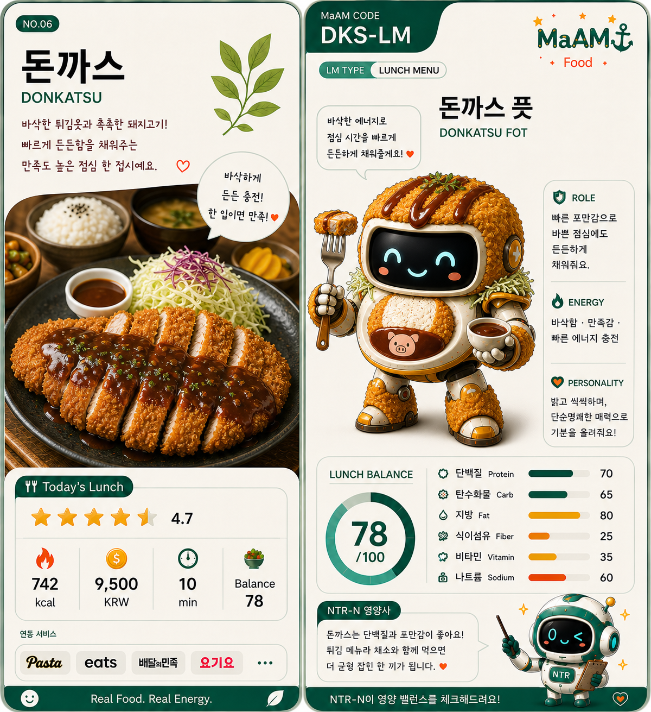

# [ MaAM LUNCH MENU ARCHIVE ]
## Menu Entity: 006_돈까스 (Donkatsu)

"바삭한 튀김옷은 점심의 기분을 빠르게 올린다."  
"든든한 한 접시가 필요할 때 꺼내는 에너지 카드."

**한국명:** 돈까스  
**영문명:** Donkatsu  
**구분:** 일본식 커틀릿 기반 한국형 점심 메뉴 / 점심 메뉴 카드  
**Menu ID:** LUNCH-006  
**Project:** MaAM (Maker and Artifact Intelligence Made)

---

## 1. MaAM 메뉴 관리 프로토콜

돈까스는 MaAM 점심 메뉴 카드 중 여섯 번째 카드다.  
이 메뉴는 돼지고기에 튀김옷을 입혀 바삭하게 튀긴 뒤, 소스와 밥, 양배추 샐러드, 국물류를 함께 구성하는 점심 메뉴다.

MaAM은 돈까스를 **바삭한 포만감 충전형 메뉴**로 분류한다.

- 돼지고기는 단백질과 포만감의 중심이 된다.
- 빵가루 튀김옷은 바삭한 식감과 만족감을 만든다.
- 돈까스 소스는 단맛, 짠맛, 새콤한 맛을 더한다.
- 양배추와 밥을 곁들이면 한 접시 식사로 완성된다.

이 카드는 빠르게 기운을 채우고 싶은 점심 시간에 강하다.  
다만 튀김 메뉴이기 때문에 기름, 소스, 나트륨 균형을 함께 살펴야 한다.

---

## 2. 음식의 유래 및 문화적 배경

돈까스는 일본의 서양식 요리 문화인 요쇼쿠에서 발전한 음식인 톤카츠에서 이어진 메뉴다.  
톤카츠는 돼지고기 등심이나 안심에 빵가루를 입혀 튀겨낸 커틀릿 요리로, 서양식 커틀릿이 일본식 식사 문화와 결합하며 대중화되었다.

한국의 돈까스는 일본식 톤카츠의 영향을 받았지만, 시간이 지나며 한국식 점심 메뉴로도 독자적인 모습을 갖게 되었다.  
특히 한국에서는 넓게 편 고기, 달콤한 갈색 소스, 밥, 양배추 샐러드, 단무지, 국물이 함께 나오는 구성이 익숙하다.

돈까스는 다음과 같은 상황에서 강하다.

- 빠르게 든든한 점심을 먹고 싶을 때
- 바삭한 식감으로 기분 전환이 필요할 때
- 밥, 샐러드, 국물이 함께 있는 한 접시 메뉴가 필요할 때
- 어린이부터 성인까지 선호도가 높은 메뉴가 필요할 때

돈까스는 단순한 튀김 요리가 아니라,  
바삭함과 포만감, 익숙한 소스 맛이 결합된 대중적인 점심 카드다.

---

## 3. 기본 재료 및 구성

```txt
Menu ID        : LUNCH-006
Main Base      : Pork cutlet
Coating        : Flour / egg / panko bread crumbs
Protein        : Pork loin / pork tenderloin
Vegetables     : Cabbage / lettuce / cucumber / tomato
Sauce          : Donkatsu sauce / demi-glace style sauce
Side           : Rice / pickles / soup
Serving Style  : Crispy fried cutlet plate
```

| Ingredient | Role |
|-----------|------|
| 돼지고기 등심 | 씹는 맛과 포만감을 만드는 기본 부위 |
| 돼지고기 안심 | 부드러운 식감을 주는 선택 부위 |
| 밀가루 | 달걀물과 빵가루가 잘 붙도록 돕는다 |
| 달걀 | 튀김옷을 연결하는 접착 역할 |
| 빵가루 | 바삭한 식감을 만드는 핵심 재료 |
| 튀김기름 | 겉면을 빠르게 익혀 바삭함을 만든다 |
| 돈까스 소스 | 달콤하고 짭짤한 풍미를 더한다 |
| 양배추 | 튀김의 느끼함을 줄이고 식이섬유를 보강한다 |
| 밥 | 한 끼 식사의 탄수화물 기반 |

### 선택 재료

- 치즈
- 카레 소스
- 매운 소스
- 데미글라스 소스
- 양파 절임
- 콘샐러드
- 우동 국물

선택 재료가 많아질수록 돈까스는 더 풍성한 점심 카드가 되지만,  
치즈, 소스, 튀김 양이 늘어나면 열량과 지방도 함께 올라갈 수 있다.

---

## 4. 맛 프로필

| Taste Element | Description |
|--------------|-------------|
| Crispy | 빵가루 튀김옷에서 오는 바삭한 식감 |
| Savory | 돼지고기와 튀김기름에서 나오는 고소한 맛 |
| Sweet | 돈까스 소스에서 오는 단맛 |
| Salty | 소스와 밑간에서 오는 짠맛 |
| Heavy | 밥과 함께 먹으면 포만감이 강해진다 |

돈까스의 핵심은 바삭함과 포만감이다.  
겉은 바삭하고 속은 촉촉해야 하며, 소스는 튀김의 고소함을 살리면서도 느끼함을 눌러주는 역할을 한다.

---

## 5. 영양소 및 식사 균형

돈까스는 재료 구성이 명확한 메뉴다.  
돼지고기, 튀김옷, 밥, 소스, 양배추가 한 접시에 모이면서 단백질, 탄수화물, 지방이 모두 포함된다.

| Nutrition Point | Source |
|----------------|--------|
| 단백질 | 돼지고기 등심, 안심 |
| 탄수화물 | 밥, 빵가루, 밀가루 |
| 지방 | 튀김기름, 돼지고기 지방 |
| 식이섬유 | 양배추, 샐러드 채소 |
| 비타민과 무기질 | 양배추, 채소 곁들임 |
| 나트륨 | 소스, 밑간, 국물류 |

### 영양 메모

- 돼지고기는 단백질 공급원이지만, 부위와 조리 방식에 따라 지방량이 달라진다.
- 튀김 조리이기 때문에 열량과 지방이 높아질 수 있다.
- 양배추 샐러드를 함께 먹으면 식이섬유와 산뜻한 식감을 보완할 수 있다.
- 소스를 많이 뿌리면 당류와 나트륨 섭취가 늘어날 수 있다.
- 균형을 위해 밥 양, 소스 양, 샐러드 양을 함께 조절하는 것이 좋다.

### NTR-N 관찰 포인트

NTR-N은 돈까스를 금지 메뉴로 보지 않는다.  
다만 다음 요소를 관찰한다.

```txt
Check 1 : 튀김옷 두께
Check 2 : 소스 사용량
Check 3 : 밥 양과 샐러드 양의 균형
Check 4 : 치즈, 카레 등 추가 토핑 여부
Check 5 : 반복 섭취 빈도
```

돈까스는 만족도와 포만감이 높은 메뉴지만,  
자주 먹을수록 튀김과 소스의 비중을 함께 살펴야 한다.

---

## 6. MaAM 카드 능력치

```txt
Crispiness     : High
Satisfaction   : High
Protein        : Medium-High
Carb Power     : Medium
Fat Level      : High
Vegetable      : Low-Medium
Sodium Risk    : Watch
Pairing Power  : Rice+Sauce
```

| Card Trait | Value |
|-----------|-------|
| Energy | 튀김과 밥 조합으로 빠르게 포만감을 준다 |
| Comfort | 익숙한 소스와 바삭한 식감으로 만족감을 높인다 |
| Speed | 메뉴 선택이 쉽고 빠르게 먹기 좋다 |
| Risk | 튀김, 소스, 치즈 토핑으로 열량이 높아질 수 있다 |

---

## 7. 관찰 기록 (메뉴 상호작용)

```txt
LOG_LUNCH_006

Player: 오늘은 빠르게 든든한 점심이 필요해요.
006_돈까스: 바삭한 튀김옷을 준비하겠습니다.
           밥과 양배추도 함께 놓겠습니다.
```

```txt
LOG_LUNCH_007

NTR-N: 이 메뉴의 장점은 무엇인가요?
006_돈까스: 만족감이 빠르게 올라갑니다.
           단백질과 탄수화물이 함께 들어 있습니다.
```

```txt
LOG_LUNCH_008

NTR-N: 주의할 점은요?
006_돈까스: 소스와 튀김이 많아지면 무거워질 수 있습니다.
           양배추를 남기지 않으면 균형이 좋아집니다.
```

이 기록은 돈까스가 단순한 튀김 메뉴가 아니라,  
바삭함, 포만감, 빠른 선택성, 균형 조절을 함께 가진 메뉴임을 보여준다.

---

## 8. 관련 개체 및 공명 맵

| Node | Role |
|------|------|
| Pork Cutlet | Main protein base |
| Panko | Crispy coating |
| Rice | Primary pairing |
| Cabbage | Balance support |
| Donkatsu Sauce | Flavor booster |
| NTR-N | Nutrition observer |
| MaAM Lunch Deck | Menu card system |

돈까스는 MaAM 점심 카드 덱에서 빠른 포만감과 높은 만족도를 담당하는 메뉴다.  
강한 에너지와 바삭한 매력을 가지지만, NTR-N의 관찰 아래 균형 있게 운용되어야 한다.

---

## Archive Remarks

돈까스는 조용히 기다리는 메뉴가 아니다.  
접시에 올라오는 순간 바삭한 소리와 함께 점심의 분위기를 바꾼다.

그래서 이 메뉴는 MaAM 아카이브에서 중요한 의미를 가진다.

기름진 무거움도, 샐러드와 밥의 균형 안에서는 한 끼가 된다.  
단순한 튀김도, 잘 조합하면 빠른 회복 카드가 된다.  
바삭한 외피는 플레이어에게 다시 움직일 힘을 준다.

돈까스는 단순한 점심 메뉴가 아니라,  
피곤한 시간을 바삭하게 깨우는 카드다.

---

## License & Creator

* **License**: MIT License
* **Project**: MaAM (Maker and Artifact Intelligence Made)
* **Creator**: **Limabella**
