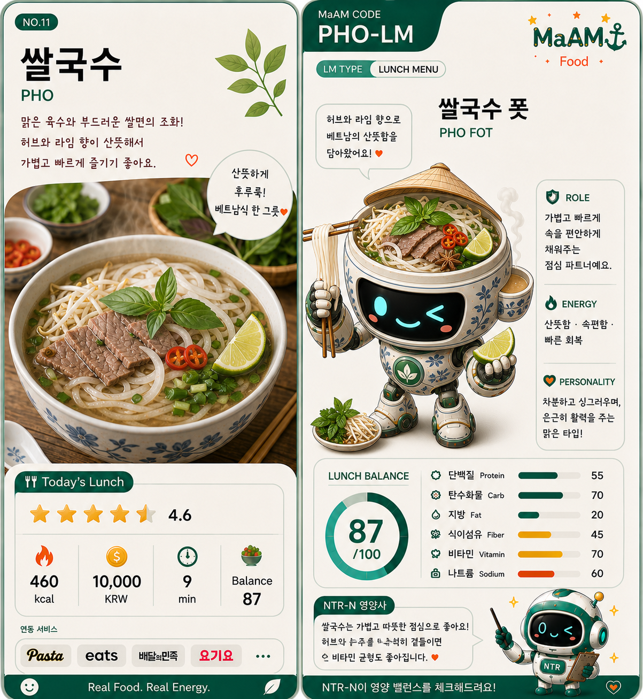

# [ MaAM LUNCH MENU ARCHIVE ]
## Menu Entity: 011_쌀국수 (Pho)

"맑은 육수는 가볍지만, 오래 끓인 시간은 깊다."  
"허브와 라임 향으로 점심 시간을 산뜻하게 열어주는 한 그릇."

**한국명:** 쌀국수  
**영문명:** Pho  
**구분:** 베트남식 쌀면 국수 / 점심 메뉴 카드  
**Menu ID:** LUNCH-011  
**MaAM Code:** PHO-LM  
**Project:** MaAM (Maker and Artifact Intelligence Made)

---

## 1. MaAM 메뉴 관리 프로토콜

쌀국수는 MaAM 점심 메뉴 카드 중 열한 번째 카드다.  
이 메뉴는 맑은 육수, 부드러운 쌀면, 고기 또는 단백질 재료, 허브와 라임을 함께 구성하는 베트남식 국수다.

MaAM은 쌀국수를 **산뜻한 회복형 국물 메뉴**로 분류한다.

- 쌀면은 부드러운 탄수화물 기반이 된다.
- 맑은 육수는 따뜻함과 수분감을 제공한다.
- 고기와 숙주는 식감과 포만감을 보강한다.
- 허브와 라임은 향과 산뜻함을 더한다.

이 카드는 무겁지 않게 속을 채우면서도,  
향신채와 따뜻한 국물로 식사 리듬을 회복시키는 점심 카드다.

---

## 2. 음식의 유래 및 문화적 배경

쌀국수, 특히 포(Pho)는 베트남을 대표하는 국수 요리로 알려져 있다.  
정확한 단일 기원을 하나로 확정하기는 어렵지만, 일반적으로 북부 베트남의 국물 국수 문화에서 발전해 베트남 전역과 세계로 퍼진 음식으로 이해된다.

포의 핵심은 단순히 쌀면을 넣은 국수가 아니라,  
오래 끓인 육수와 향신채, 얇게 썬 고기, 라임, 고추, 숙주 등을 함께 조합해 먹는 방식에 있다.

특히 쌀국수는 다음과 같은 상황에서 강하다.

- 점심에 너무 무겁지 않은 국물 메뉴가 필요할 때
- 따뜻하지만 산뜻한 한 그릇을 먹고 싶을 때
- 고기, 숙주, 허브를 함께 먹고 싶을 때
- 빠르게 먹되 속이 편한 메뉴가 필요할 때
- 매운맛보다 향과 국물의 균형이 중요할 때

쌀국수는 기름진 튀김류와 달리,  
맑은 국물과 부드러운 면을 중심으로 식사를 편안하게 만드는 생활형 메뉴에 가깝다.

---

## 3. 기본 재료 및 구성

```txt
Menu ID        : LUNCH-011
MaAM Code      : PHO-LM
Main Base      : Rice noodles
Broth          : Beef broth / chicken broth / vegetable broth
Protein        : Beef / chicken / tofu
Vegetables     : Bean sprouts / onion / green onion / cilantro
Fresh Herbs    : Thai basil / cilantro / mint
Seasoning      : Fish sauce / lime / chili / pepper
Serving Style  : Hot noodle soup with herbs and lime
```

| Ingredient | Role |
|-----------|------|
| 쌀면 | 부드러운 식감과 탄수화물 에너지를 제공하는 핵심 재료 |
| 육수 | 따뜻함, 감칠맛, 메뉴의 깊이를 만드는 바탕 |
| 소고기 또는 닭고기 | 단백질과 포만감을 보강 |
| 숙주 | 아삭한 식감과 산뜻함을 더한다 |
| 양파 | 국물의 단맛과 향을 보강 |
| 대파 | 국물의 향과 마무리 풍미를 만든다 |
| 고수와 허브 | 쌀국수 특유의 향과 개성을 만든다 |
| 라임 | 산미를 더해 국물을 가볍고 선명하게 만든다 |
| 고추 | 선택적으로 매운맛과 긴장감을 더한다 |

### 선택 재료

- 차돌박이
- 양지
- 닭가슴살
- 두부
- 청경채
- 고수 추가
- 스리라차 소스
- 해선장

선택 재료에 따라 쌀국수는 더 든든한 식사도,  
더 가벼운 회복 메뉴도 될 수 있다.

---

## 4. 맛 프로필

| Taste Element | Description |
|--------------|-------------|
| Clear | 맑은 육수에서 오는 깨끗한 맛 |
| Savory | 고기 육수와 피시소스에서 오는 감칠맛 |
| Fresh | 허브, 숙주, 라임이 만드는 산뜻함 |
| Soft | 쌀면의 부드럽고 미끄러운 식감 |
| Light | 튀김 메뉴보다 부담이 적은 식사감 |

쌀국수의 핵심은 강한 자극보다 균형이다.  
따뜻한 국물, 부드러운 면, 향긋한 허브, 상큼한 라임이 함께 어우러지며 점심 식사에 편안한 회복감을 준다.

---

## 5. 영양소 및 식사 균형

쌀국수는 쌀면을 중심으로 탄수화물이 많고,  
고기나 두부를 넣으면 단백질 균형이 좋아지는 국물 면 요리다.

| Nutrition Point | Source |
|----------------|--------|
| 탄수화물 | 쌀면 |
| 단백질 | 소고기, 닭고기, 두부 |
| 수분 | 따뜻한 육수 |
| 식이섬유 | 숙주, 양파, 허브, 채소 |
| 비타민과 무기질 | 숙주, 허브, 라임, 채소류 |
| 나트륨 | 육수, 피시소스, 소스류 |

### 영양 메모

- 쌀면은 부드럽고 빠르게 먹기 좋은 탄수화물 기반이다.
- 고기나 두부를 충분히 넣으면 단백질 균형이 좋아진다.
- 숙주와 허브를 함께 먹으면 식감과 신선함이 살아난다.
- 라임은 산뜻한 향과 산미를 더해 국물의 무거움을 줄여준다.
- 국물과 소스를 많이 섭취하면 나트륨 섭취가 높아질 수 있다.
- 튀김류나 진한 크림 메뉴보다 비교적 가볍게 느껴질 수 있다.

### NTR-N 관찰 포인트

NTR-N은 쌀국수를 가볍고 따뜻한 점심 메뉴로 평가한다.  
다만 다음 요소를 관찰한다.

```txt
Check 1 : 국물 섭취량
Check 2 : 단백질 토핑의 양
Check 3 : 숙주와 허브 추가 여부
Check 4 : 소스 사용량
Check 5 : 면 중심 식사가 반복되는 빈도
```

쌀국수는 산뜻한 메뉴지만,  
면과 국물 위주로만 먹으면 단백질과 채소 균형이 부족할 수 있다.

---

## 6. MaAM 카드 능력치

```txt
Warmth        : Medium-High
Freshness     : High
Satisfaction  : Medium
Spice         : Optional
Protein       : Medium
Vegetable     : Medium
Sodium Risk   : Watch
Recovery      : High
```

| Card Trait | Value |
|-----------|-------|
| Freshness | 허브, 숙주, 라임으로 산뜻한 식사감을 준다 |
| Recovery | 따뜻한 육수와 부드러운 면으로 속을 편하게 만든다 |
| Flexibility | 고기, 닭고기, 두부, 채소 등 다양한 변형이 가능하다 |
| Risk | 국물과 소스 사용량에 따라 나트륨이 높아질 수 있다 |

---

## 7. 관찰 기록 (메뉴 상호작용)

```txt
LOG_LUNCH_011

Player: 오늘은 가볍지만 따뜻한 점심이 필요해요.
011_쌀국수: 맑은 육수를 준비하겠습니다.
            라임과 허브도 함께 드릴게요.
```

```txt
LOG_LUNCH_012

NTR-N: 이 메뉴의 장점은 무엇인가요?
011_쌀국수: 부드러운 쌀면과 따뜻한 국물이 있습니다.
            숙주와 허브를 더하면 산뜻함도 살아납니다.
```

```txt
LOG_LUNCH_013

NTR-N: 주의할 점은요?
011_쌀국수: 국물을 전부 마시면 짤 수 있습니다.
            고기와 채소를 충분히 곁들이면 균형이 좋아집니다.
```

이 기록은 쌀국수가 단순한 면 요리가 아니라,  
따뜻함, 산뜻함, 빠른 식사, 균형 조절을 함께 가진 메뉴임을 보여준다.

---

## 8. 관련 개체 및 공명 맵

| Node | Role |
|------|------|
| Rice Noodles | Main carbohydrate base |
| Broth | Warmth and flavor foundation |
| Beef / Chicken | Protein balance |
| Bean Sprouts | Texture and freshness |
| Lime | Bright acidity |
| Herbs | Aroma identity |
| NTR-N | Nutrition observer |
| MaAM Lunch Deck | Menu card system |

쌀국수는 MaAM 점심 카드 덱에서 산뜻한 국물 회복 메뉴다.  
든든함보다는 편안함과 향을 중심으로 작동하며, NTR-N의 관찰 아래 단백질과 채소를 보강하면 더 안정적인 한 끼가 된다.

---

## Archive Remarks

쌀국수는 강하게 밀어붙이는 메뉴가 아니다.  
조용히 따뜻한 국물을 내고, 부드러운 면으로 속을 채운다.

허브는 향을 열고, 라임은 국물을 깨운다.  
숙주는 식감으로 리듬을 만들고, 고기는 식사의 중심을 잡는다.

그래서 이 메뉴는 MaAM 아카이브에서 중요한 의미를 가진다.

가벼움은 약함이 아니다.  
맑은 국물도 충분히 회복을 만들 수 있다.  
쌀국수는 점심 시간을 조용히 다시 정렬하는 카드다.

---

## License & Creator

* **License**: MIT License
* **Project**: MaAM (Maker and Artifact Intelligence Made)
* **Creator**: **Limabella**
