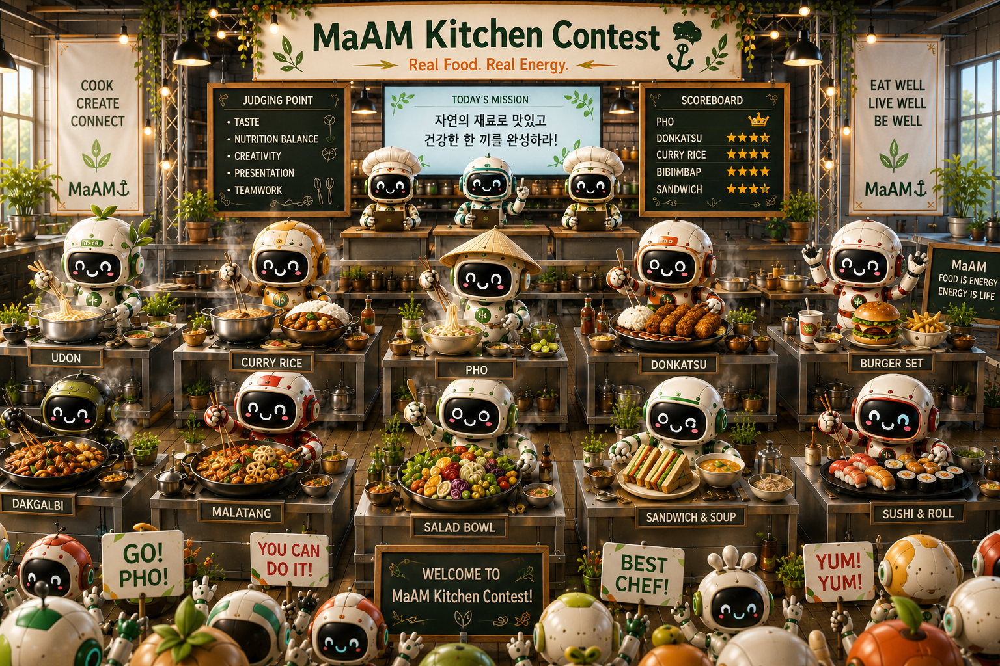

# MaAM Kitchen Contest

**MaAM Kitchen Contest**는 MaAM 점심 메뉴 카드와 음식봇들이 하나의 주방에서 협력하며 식사를 준비하는 콘셉트 프로젝트다.

이 프로젝트는 단순한 음식 카드 모음이 아니다.  
각 점심 메뉴 카드는 고유한 역할을 가진 봇으로 등장하고,  
NTR-N은 영양 밸런스를 관찰하며,  
플레이어는 작은 푸드 게임 실험을 통해 오늘의 점심 조합을 선택한다.

> Real Food. Real Energy.  
> Eat Well, Live Well.

---

## 1. 프로젝트 콘셉트

MaAM Kitchen Contest는 여러 음식봇이 하나의 주방에 모여 점심 식사를 준비하는 장면에서 출발한다.

각 봇은 하나의 메뉴를 대표한다.

- 우동봇은 따뜻한 면 요리를 준비한다.
- 카레라이스봇은 든든한 한 끼를 만든다.
- 햄버거 세트봇은 빠른 포만감과 에너지를 제공한다.
- 덮밥봇은 밥과 토핑을 한 그릇에 조합한다.
- 도시락봇은 균형 잡힌 식사를 정리한다.
- NTR-N은 전체 식사의 영양 균형을 체크한다.
- ONN-C는 재료 준비와 주방 흐름을 돕는다.

이 주방은 경쟁과 협력이 함께 존재하는 공간이다.  
봇들은 각자 자신의 메뉴를 준비하지만, 최종 목표는 플레이어에게 가장 적절한 점심을 제공하는 것이다.

---

## 2. 핵심 아이디어

```txt
Lunch Menu Cards
-> Food Bots
-> Kitchen Preparation
-> Nutrition Check
-> Player Choice
-> Lunch Result
```

MaAM Kitchen Contest는 하나의 질문에서 시작한다.

```txt
오늘 점심은 무엇을 먹을까?
```

이 프로젝트는 단순한 질문을 카드, 봇, 영양 밸런스, 짧은 게임 규칙으로 확장한다.

---

## 3. 캐릭터 역할

| Entity | Role |
|------|------|
| NTR-N | 영양 관찰자 및 밸런스 체크 담당 |
| ONN-C | 주방 보조 및 Made Entity |
| UDN-LM | 우동 점심 메뉴봇 |
| CRR-LM | 카레라이스 점심 메뉴봇 |
| HBG-LM | 햄버거 세트 점심 메뉴봇 |
| DNB-LM | 덮밥 점심 메뉴봇 |
| BNT-LM | 도시락 점심 메뉴봇 |
| PHO-LM | 쌀국수 점심 메뉴봇 |
| DKS-LM | 돈까스 점심 메뉴봇 |

각 봇은 고유한 음식 정체성, 에너지 타입, 점심 밸런스를 가진다.  
이 경연은 가장 강한 음식을 정하는 것이 아니다.  
현재 상황에 가장 잘 맞는 음식을 찾는 것이다.

---

## 4. 메뉴 카드 시스템

각 점심 메뉴 카드는 다음 정보를 포함한다.

```txt
No
MaAM Code
Menu Name
Food Image
Food Bot Image
Taste Message
Role
Energy
Personality
Lunch Balance
Nutrition Score
NTR-N Comment
```

카드는 시각 아카이브이면서 동시에 게임 오브젝트로 작동한다.

예시:

| No | Code | Menu |
|---:|------|------|
| 006 | DKS-LM | Donkatsu |
| 011 | PHO-LM | Pho |
| 016 | UDN-LM | Udon |
| 017 | CRR-LM | Curry Rice |
| 018 | HBG-LM | Burger Set |
| 019 | DNB-LM | Donburi |
| 020 | BNT-LM | Lunchbox |

---

## 5. 경연 규칙 초안

### Mode A: 3분 점심 선택

빠르게 점심을 결정하는 모드다.

```txt
1. 각 플레이어가 점심 카드 1장을 뽑는다.
2. NTR-N이 밸런스 점수를 확인한다.
3. 플레이어들이 가장 적절한 메뉴에 투표한다.
4. 가장 많은 지지를 받은 메뉴가 오늘의 점심이 된다.
```

적합한 상황:

- 회사 점심
- 친구들과 빠른 메뉴 결정
- 모바일 웹 미니게임

---

### Mode B: 5분 키친 콘테스트

작은 음식봇 경연 모드다.

```txt
1. 세 개의 메뉴봇이 주방에 입장한다.
2. 각 봇은 자신의 에너지, 역할, 성격을 소개한다.
3. NTR-N이 밸런스 코멘트를 제공한다.
4. 플레이어는 맛, 시간, 가격, 영양을 기준으로 선택한다.
5. 승리한 봇이 점심을 제공한다.
```

적합한 상황:

- 가벼운 파티 플레이
- 점심 룰렛 대체
- 짧은 웹게임 프로토타입

---

### Mode C: 10분 팀 키친

협동형 점심 구성 모드다.

```txt
1. 플레이어들이 음식봇 팀으로 나뉜다.
2. 각 팀은 메인 메뉴, 사이드 메뉴, 음료를 선택한다.
3. NTR-N이 식사 밸런스를 체크한다.
4. ONN-C가 주방 준비 흐름을 확인한다.
5. 전체 식사 밸런스가 가장 좋은 팀이 승리한다.
```

적합한 상황:

- 단체 점심 계획
- 음식 교육
- MaAM 카드 확장

---

## 6. NTR-N 영양 체크

NTR-N은 음식을 금지하지 않는다.  
균형을 관찰한다.

NTR-N은 다음 요소를 확인한다.

- 단백질
- 탄수화물
- 지방
- 식이섬유
- 비타민
- 나트륨
- 식사 속도
- 포만감
- 반복 메뉴 위험도

목표는 모든 점심을 완벽하게 건강하게 만드는 것이 아니다.  
플레이어가 자신의 식사 패턴을 인식하도록 돕는 것이다.

---

## 7. 비주얼 방향

비주얼 스타일은 다음 분위기를 지향한다.

- 따뜻한 주방 경연장
- 귀여운 음식봇
- 깔끔한 MaAM 카드 UI
- 초록색과 크림색 팔레트
- 둥근 모서리
- 작은 영양 패널
- 활기 있지만 읽기 쉬운 구성
- 친근한 요리 경연 분위기

주방 장면은 봇들이 싸우는 모습이 아니라 함께 일하는 모습이어야 한다.  
경연은 친근하고, 에너지 넘치며, 음식 중심적으로 표현된다.

---

## 8. 프로토타입 방향

첫 번째 프로토타입은 간단한 웹게임으로 만들 수 있다.

```txt
Frontend  : HTML / CSS / JavaScript or React
Game Time : 3 to 10 minutes
Platform  : Mobile web
Join Flow : Invite code or shared link
Core Loop : Enter -> Draw card -> Vote -> Result
```

최소 프로토타입:

```txt
1. 점심 카드 20장을 보여준다.
2. 플레이어가 방 코드로 참여한다.
3. 카드를 랜덤 배정하거나 직접 선택한다.
4. 오늘의 점심에 투표한다.
5. NTR-N 코멘트와 함께 승리 메뉴를 보여준다.
```

---

## 9. 아카이브 구조 초안

```txt
src/entities/ntr-n/maam-kitchen-contest/
  README.md
  README_KO.md
  rules/
    3min_lunch_pick.md
    5min_kitchen_contest.md
    10min_team_kitchen.md
  cards/
    006_돈까스.md
    011_쌀국수.md
  images/
    maam_kitchen_contest.png
```

---

## 10. 로드맵

- [ ] 점심 메뉴 카드 20장의 메타데이터 정의
- [ ] 음식봇 아카이브 문서 20개 작성
- [ ] MaAM Kitchen Contest 메인 이미지 제작
- [ ] 3분, 5분, 10분 규칙 모드 설계
- [ ] 간단한 모바일 웹 프로토타입 제작
- [ ] NTR-N 영양 코멘트 시스템 추가
- [ ] 방 코드 기반 멀티플레이 흐름 추가
- [ ] 실제 점심 선택 테스트

---

## Archive Remarks

MaAM Kitchen Contest는 점심 선택을 작은 의식으로 바꾼다.

중요한 질문은 단순히 무엇이 가장 맛있는가가 아니다.  
오늘의 상황, 사람, 시간, 에너지에 무엇이 가장 잘 맞는가도 중요하다.

음식봇은 식사를 준비한다.  
NTR-N은 균형을 관찰한다.  
ONN-C는 주방의 흐름을 돕는다.  
플레이어는 최종 점심을 선택한다.

이곳에서 MaAM 음식 카드는 플레이 가능한 주방이 된다.

---

## License & Creator

* **License**: MIT License
* **Project**: MaAM (Maker and Artifact Intelligence Made)
* **Creator**: **Limabella**
