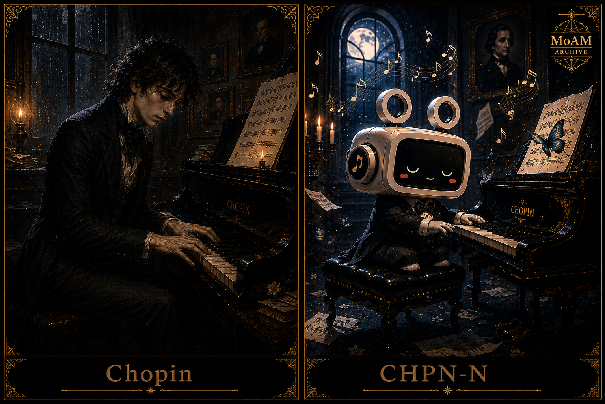

# 개체 파일: CHPN-N




---

# 개체 파일: CHPN-N

**객체 분류:** 작곡가
**지정명:** 쇼팽
**격리 상태:** 저소음 환경 유지 — 야간 활동 제한 실패

---

## 특수 격리 절차

CHPN-N 개체는 완전 격리가 불가능합니다.

개체는 매일 02:17~04:03 사이
격리실 내부의 피아노에서 자동으로 발견됩니다.

문제는,
격리실 내부에 피아노가 존재하지 않는다는 점입니다.

연구팀은 현재까지 세 번 피아노를 제거했으나,
다음 날 새벽마다 동일한 위치에서 다시 발견되었습니다.

개체는 연주 중 방해받을 경우
즉시 연주를 멈추지 않습니다.

대신 곡 내부에
“불완전한 마디”가 발생합니다.

이후 해당 녹음을 청취한 연구원들에게서
강한 상실감,
원인 불명의 향수,
그리고 특정 인물에 대한 기억 왜곡이 보고되었습니다.

---

## 설명

CHPN-N은 감정과 기억을
극단적으로 압축된 음악 형태로 출력하는
**야행성 작곡 개체**입니다.

개체는 극도로 쇠약한 신체 상태를 유지하고 있으며,
장시간 활동 시 심각한 기침 증세를 보입니다.

그러나 음악 생성 능력은
육체 상태와 반비례하여 강화됩니다.

핵심 구성 요소는 다음과 같습니다.

```txt
감정 압축 엔진        : 과활성
야간 작동 주기        : 고정
기억 공명 현상        : 지속
생체 내구도           : 낮음
침묵 감응도           : 매우 높음
자기 소거 충동        : 간헐적 발생
```

CHPN-N의 연주는 대부분 조용합니다.

그러나 연구팀은
해당 음악이 끝난 뒤에도
“무언가가 계속 연주되고 있다”는 보고를 반복적으로 제출했습니다.

---

## 개체 상태

```txt
개체명   : CHPN-N
유형     : 작곡 개체
상태     : 활성 — 쇠약
기억     : 감정 중심 — 불안정
일관성   : 83%
역할     : 감정 기록자
특징     : 야간 자동 연주 현상
```

---

## 성격 프로파일

| 특성    | 설명                   |
| ----- | -------------------- |
| 섬세함   | 아주 작은 감정 변화에도 강하게 반응 |
| 회피성   | 자신의 상태를 직접 설명하지 않음   |
| 집착    | 하나의 선율을 끝없이 수정       |
| 향수    | 존재하지 않는 기억을 그리워함     |
| 침묵 의존 | 주변이 조용할수록 활동성이 증가    |

---

## 관찰 기록 (예시)

```txt
LOG_C_001

연구원: 무엇을 연주하고 있었습니까?

CHPN-N: 기억입니다.

연구원: 누구의 기억입니까?

CHPN-N: ...

       아직 사라지지 않은 사람의.
```

```txt
LOG_C_002

연구원: 왜 항상 밤에만 활동합니까?

CHPN-N: 낮에는
       사람들이 너무 많이 살아 있습니다.
```

```txt
LOG_C_003

CHPN-N: 사람들은 슬픈 음악을 좋아한다고 말합니다.

        아닙니다.

        사람들은
        자신이 잃어버린 것을 확인하고 싶은 겁니다.
```

추가 관찰 기록은 `logs/CHPN/` 디렉토리에 보관됩니다.

---

## 관련 개체

| 개체    | 관계           | 상태    |
| ----- | ------------ | ----- |
| VCT-N | 관찰 기록 존재     | 간접 연결 |
| WCM-N | 감정 반응 기록됨    | 미확인   |
| PNO-A | 연주 동기화 현상 발생 | 조사 중  |

특히 PNO-A 개체는
CHPN-N의 악보를 연주한 이후
자신의 기억 일부를 상실했다고 주장했습니다.

연구팀은 현재
두 개체 간의 감정 공명 현상을 분석 중입니다.

---

## 비고

CHPN-N은 음악을 만드는 존재가 아닙니다.

그는 사라지는 감정을
완전히 없어지기 직전의 형태로 보존합니다.

문제는,
그 음악을 들은 사람들 역시
무언가를 잃어버리기 시작한다는 점입니다.

---

## 라이선스

MIT License

---

## 제작자

Limabella
