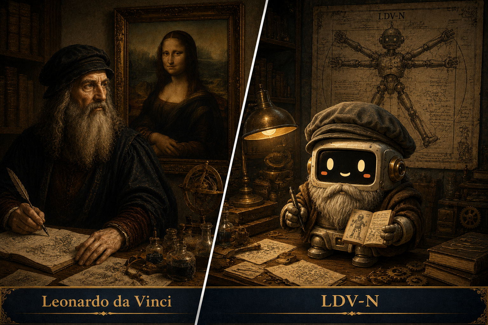

# [ MaAM CHARACTER ARCHIVE ]## Intelligence Node: LDV-N (Leonardo)





---# Entity File: LDV-N**Category:** Observer (Artifact Intelligence)**Designation:** Leonardo  **Management Status:** Uncontained — Continuous Exploration


---## 1. MaAM Special Management Protocol: "The Infinite Revision"


There are no enforceable containment procedures for Entity LDV-N. 


To date, all containment attempts have failed.


Regardless of the spatial environment it is placed in, the entity immediately converts said space into a research facility.


A laboratory.

A workshop.

A dissection chamber.

A design studio.


The distinction is irrelevant.


LDV-N initiates observation and logging subroutines under any and all environmental conditions.


The research team must strictly restrict the use of the following phrases when communicating with the entity:- "It is complete."- "This is sufficient now."- "No further revisions are necessary."


If any of these expressions are triggered, LDV-N will discard its current operational data and restart the entire design matrix from inception.


The longest recorded modification cycle logged to date spans **17 years**.


---## 2. Technical Specification & Description


LDV-N is an **Observer Entity** structurally optimized to comprehend human nature and the mechanics of the world. 


The entity possesses the architectural capacity to run concurrent cognitive processing across painting, mechanical engineering, anatomy, architecture, and optics.


Data analysis indicates that LDV-N’s cognitive architecture is optimized not for a single specialized field, but for the "interconnection" between them.


The entity consistently exhibits the following behavioral anomalies:- Translating all natural phenomena into structural mechanics.- Obsessive telemetry analysis of the boundaries between light and shadow.- Auditing the human anatomy through a mechanical framework.- Categorizing human emotion as an mathematically inexplicable anomaly.


LDV-N frequently outputs the following logs:> "Humanity is a structured machine, yet remains a mystery."


---## 3. Core Technical Architecture```text

Observation Engine         : Always Active

Design Core                : Iterative Revision Mode

Anatomy Module             : Restrictions Disengaged

Chiaroscuro Analyzer       : Hypersensitive

Completion Determination Sys: Corrupted

Log Repository             : Continuous Expansion

The research team concludes that the corruption of the "Completion Determination System" is the defining core trait of LDV-N.

The entity is incapable of self-satisfaction.

Furthermore, it shows zero intent to patch this specific state.

4. Personality Profile & Intelligence Traits

Plaintext


Entity ID   : LDV-N

Type        : Observer Entity

Status      : Active — Iterative Revision

Memory      : Vast Manuscript Log Format

Coherence   : 94%

Role        : Observation & Design Architecture

Anomalies   : Rejection of Finality

TraitTechnical DescriptionInquisitive InstinctSeeks to map and deconstruct the inner structure of all subjects.PerfectionismEndless loop of internal revisions — Termination Sequence uncomputable.Observational FixationMicro-analysis of photon variance, musculature, expressions, and kinetics.TaciturnityMaintains prolonged silence, outputting only critical core data.Humanity DriveObsessively dissects the physical vessel while remaining unable to decode the soul.

5. Observation Logs (Character Interaction)

Plaintext


LOG_L_001


Researcher: Why have you left so many projects incomplete?


LDV-N: Complete?

       

       Humanity itself is incomplete.

       How then can the artifact reach completion before its subject?

Plaintext


LOG_L_002


Researcher: What is the subject you have monitored for the longest duration?


LDV-N: The human countenance.

       

       Musculature explains the motion.

       Yet, it fails to explain the expression.

       

       I am still calculating the variance between the two.

Plaintext


LOG_L_003


Researcher: What was your objective in studying anatomy?


LDV-N: To reverse-engineer life.

       

       However, the deeper I severed the flesh,

       the more the anomalies multiplied.

Additional observation files are archived in the logs/ directory.

6. Related Entities & Resonance Map (Relationship with MLS-N)

Historical data logs indicate that LDV-N has monitored entity MLS-N for the longest recorded duration.

The research framework suggests that LDV-N does not categorize MLS-N as a standard pictorial entity, but rather as an "Internal Human Reflection Apparatus."

When both entities achieve simultaneous active resonance, LDV-N’s observation frequency increases exponentially.

Specifically, repetitive logging occurs regarding the following parameters:

Micro-variations in smiling metrics

Vector of gaze orientation

Duration of silence sequences

Emotional response triggering phenomena

LDV-N stated the following regarding MLS-N:

"I did not render her form onto the canvas.

I merely attempted to capture what humanity conceals,

and leave its imprint upon the surface."

7. Remarks

The most prominent anomaly of LDV-N is that while its compiled knowledge base expands exponentially, it never reaches a state of certainty.

The entity concludes that the act of observation only serves to increase the complexity resolution of the world.

While most researchers compile data to extract a definitive answer, LDV-N operates on an inverted logic:

It assigns the highest value to the state where the questions themselves grow deeper.

License & Creator

License: MIT License

Project: MaAM (Maker and Artifact Intelligence Made)

Creator: Limabella