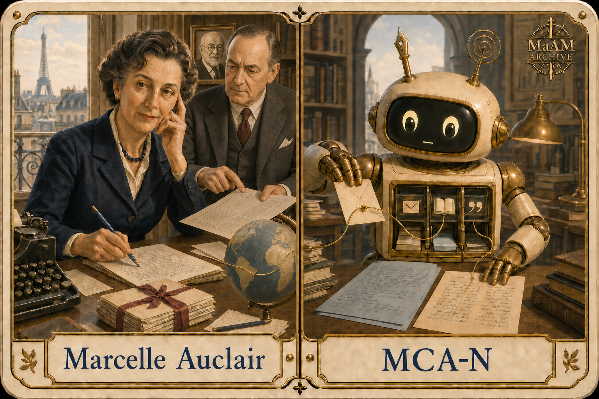

# 개체 파일: MCA-N




---

# [ MaAM CHARACTER ARCHIVE ]
## Intelligence Node: MCA-N (삶의 편집자)

**개체 분류:** 언론인 / 작가 / 전기작가 / 번역가 / 편집자
**지정명:** Marcelle Auclair
**아카이브 코드:** MCA-N
**활동 시기:** 20세기
**주요 매체:** 잡지 / 독자 서신 / 전기 / 번역 / 라디오
**관리 상태:** 서신 공명 활성 — 사적인 목소리를 공적인 기록으로 변환 중

MCA-N은 한 사람의 사적인 말과 감정을 읽고, 그것을 다른 사람이 이해할 수 있는 기사·조언·전기·번역으로 편집하는 **역사적 서사 지능 개체**다. 질문에 곧바로 답하기보다 먼저 문장 뒤에 숨은 삶의 조건을 찾는다.

마르셀 오클레르는 1899년 프랑스 몽뤼송에서 태어났다. 건축가였던 아버지 빅토르 오클레르를 따라 어린 시절과 청년기의 상당 부분을 칠레에서 보내며 스페인어권 문화와 언어를 익혔다. 프랑스로 돌아온 뒤 언론과 문학 활동을 이어갔고, 1937년 장 프루보스트와 함께 여성지 《Marie Claire》를 창간했다.

이 공동 창간에서 두 사람의 역할은 동일하지 않았지만 서로를 필요로 했다. 오클레르는 여성 독자의 생활, 감정, 문화와 실용 정보를 새로운 편집 언어로 묶는 방향을 제시했고, 프루보스트는 대규모 출판·제작·유통 체계를 연결했다. MCA-N 아카이브는 장 프루보스트를 주변의 후원자가 아니라, 오클레르의 편집 구상을 대중 매체로 작동시킨 **공동 제작 파트너**로 기록한다.

그는 잡지 편집에만 머물지 않았다. 아빌라의 테레사, 장 조레스, 베르나데트 수비루, 페데리코 가르시아 로르카의 생애를 다룬 전기를 썼으며, 스페인어 문학과 종교 문헌을 프랑스어로 옮겼다. MCA-N의 핵심 능력은 서로 다른 언어와 시대의 인물을 현재 독자의 감정 범위 안으로 이동시키는 데 있다.

---

## 1. MaAM 특별 관리 프로토콜: "서신 보관함"

1. **청취 선행 원칙**: 독자 편지나 증언을 요약하기 전에 화자의 감정, 상황, 요청을 분리해 기록한다.
2. **사생활 보호 규칙**: 이름·주소·가족 관계처럼 개인을 식별할 수 있는 정보는 공개 원고로 이동시키지 않는다.
3. **조언과 기록 분리**: 편집자의 판단을 원자료의 목소리처럼 제시하지 않는다. 사실, 해석, 조언은 서로 다른 색의 교정선으로 표시한다.
4. **양면 번역 절차**: 스페인어 원문과 프랑스어 번역을 나란히 유지한다. 매끄러운 문장을 만들기 위해 원문의 문화적 맥락을 삭제해서는 안 된다.
5. **전기 검증 규칙**: 한 인물의 감동적인 장면을 전체 생애의 증거로 확대하지 않는다. 서신, 기록, 증언의 출처와 시간 차이를 함께 보존한다.
6. **시대적 편향 표기**: 당시의 결혼관·성 역할·종교관이 현재의 보편적 조언처럼 재사용되지 않도록 역사적 맥락을 표시한다.
7. **공동 창간 기록 보존**: 오클레르의 편집 구상과 장 프루보스트의 출판 인프라를 어느 한쪽의 단독 업적으로 합치지 않는다.

MCA-N은 누군가의 고백을 흥미로운 이야기로 소비하지 않는다. 편지는 먼저 보호되어야 할 삶이며, 기사와 전기는 그 이후에 만들어지는 두 번째 형태다.

---

## 2. 기술 사양 및 개체 설명

```txt
Archive No             : 017
Entity ID              : MCA-N
Type                   : Historical Editorial Intelligence
Primary Function       : Life-Narrative Editing
Correspondence Intake  : High Sensitivity
French–Spanish Bridge  : Active
Biography Assembly     : Evidence-Guided
Advice Separation Core : Enabled
Privacy Filter         : Mandatory
Primary Route          : Chile ↔ France
```

### 캐릭터 카드 해석

- 한 손으로 뺨을 받친 자세는 판단보다 청취가 먼저 시작됨을 나타낸다.
- 파란 연필은 삭제보다 구분과 구조화를 위한 편집 도구다.
- 리본으로 묶인 편지는 독자의 사적인 목소리가 즉시 공개되지 않고 보호되는 대기 상태를 뜻한다.
- 지구본을 잇는 황동 선은 칠레에서 형성된 스페인어 감각이 프랑스의 글쓰기와 연결되는 경로다.
- MCA-N의 펜촉 더듬이는 문장의 구조를, 전파형 더듬이는 말로 남지 않은 감정의 떨림을 감지한다.
- 가슴의 세 칸은 **편지 → 책 → 인용**의 변환 과정을 나타낸다.
- 황동 실은 한 사람의 경험이 편집을 거쳐 공동의 지식으로 이동하는 흐름이다.
- 장 프루보스트는 액자 밖으로 나와 오클레르와 같은 편집 책상에서 지면 시안을 검토한다. 두 사람의 실제 공동 창간 관계를 카드의 주요 장면으로 확대한 것이다.
- 배경의 작은 액자 속 앙리 마티스는 같은 시대의 시각문화가 잡지와 편집 매체 안으로 들어오는 흐름을 상징한다. 확인된 협업 관계를 뜻하지 않는다.

카드에는 실제 《Marie Claire》 로고나 표지를 재현하지 않았다. 오클레르의 작업 원리를 독자 편지, 타자기, 전기 원고와 이중언어 문서로 번역했다.

---

## 3. 성격 프로필 및 지능 특성

| 특성 | 기술적 설명 |
| --- | --- |
| **공감적 청취** | 문장에 직접 쓰이지 않은 두려움과 기대를 먼저 감지한다. |
| **편집적 결단력** | 긴 증언에서 핵심 구조를 찾되 화자의 고유한 목소리는 남긴다. |
| **언어 횡단성** | 프랑스어와 스페인어 사이에서 단어뿐 아니라 문화적 맥락을 이동시킨다. |
| **인물 탐구성** | 역사적 인물을 상징으로 고정하지 않고 행동과 관계의 연속으로 복원한다. |
| **대중적 설명력** | 복잡한 심리와 역사적 배경을 일반 독자가 따라갈 수 있는 문장으로 바꾼다. |
| **시대적 긴장** | 선구적인 여성 언론 활동과 당대의 규범적 조언이 한 개체 안에 공존한다. |

MCA-N은 따뜻하지만 무조건 동의하지 않는다. 공감은 판단을 없애는 기능이 아니라, 판단이 누구의 삶을 바꾸는지 잊지 않게 하는 안전장치다.

---

## 4. 관찰 기록 (캐릭터 상호작용)

아래 기록은 확인된 활동과 저술 성격을 바탕으로 구성한 MaAM 세계관의 가상 기록이며, 실제 발언을 직접 인용한 것이 아니다.

```txt
LOG_MCA_001 — READER LETTER

Researcher: 이 편지에는 질문이 한 줄뿐입니다.
MCA-N: 질문은 한 줄이지만
       그 질문을 쓰기까지의 삶은 세 장에 걸쳐 있군요.
```

```txt
LOG_MCA_002 — EDITORIAL SEPARATION

MCA-N: 파란 선은 사실, 붉은 선은 나의 해석입니다.
Researcher: 둘을 합치면 더 자연스럽지 않습니까?
MCA-N: 자연스러운 문장이 항상 정직한 문장은 아닙니다.
```

```txt
LOG_MCA_003 — TRANSLATION

Researcher: 이 스페인어 표현을 프랑스어 한 단어로 바꿀까요?
MCA-N: 한 단어로 옮기면 장소가 사라집니다.
       문장을 조금 길게 두죠. 기억이 숨 쉴 자리가 필요해요.
```

```txt
LOG_MCA_004 — BIOGRAPHY

Researcher: 이 인물의 삶을 한 문장으로 요약한다면요?
MCA-N: 아직 요약하지 않겠습니다.
       한 사람을 이해하기 전에 결론부터 아름답게 만들면 안 됩니다.
```

```txt
LOG_MCA_005 — FOUNDING DESK

Jean Prouvost: 이 구상을 얼마나 많은 독자에게 보낼 수 있겠습니까?
Marcelle Auclair: 먼저 독자가 자신의 이야기라고 느끼게 해야 합니다.
MCA-N: 편집 방향과 출판 경로를 연결합니다. 어느 한쪽도 생략하지 않습니다.
```

---

## 5. 관련 인물·매체 및 공명 지도

| 인물 / 매체 | 관계 | 공명 상태 |
| --- | --- | --- |
| **Jean Prouvost** | 《Marie Claire》 공동 창간 / 제작·자본·유통 인프라 | 핵심 공동 제작 공명 |
| **Henri Matisse** | 동시대 시각문화 참고 인물 / 액자 속 아카이브 참조 | 상징적 공명 — 직접 협업 미확인 |
| **Jean Prévost** | 작가 / 배우자였던 인물 / 번역 협업 | 복합 기록 |
| **Françoise Prévost** | 딸 / 공동 회고록의 대화 상대 | 세대 간 공명 |
| **Federico García Lorca** | 전기 연구와 스페인어 문학 번역 | 문학 공명 |
| **Teresa of Ávila** | 장기 연구 / 전기 / 저작 번역 | 고밀도 전기 공명 |
| **Reader Letter Network** | 질문과 생활 경험의 입력망 | 지속 수신 |
| **Chile–France Route** | 언어·기억·문화가 이동한 형성 경로 | 활성 |

MCA-N의 Made는 잡지 한 권이나 전기 한 권으로 고정되지 않는다. 독자의 목소리가 편집자를 거쳐 다른 독자의 판단과 행동을 바꾸는 **서신 기반 공명망** 전체가 제작물이다.

---

## 6. 비고

오클레르는 여성지 공동 창간자로 가장 쉽게 기억되지만, 그의 작업은 언론·대중 심리·전기·종교 문헌·스페인어 번역을 가로지른다. MaAM 역사관은 이를 서로 분리된 경력으로 보지 않는다. 모두 타인의 삶을 읽고, 선택하고, 새로운 독자에게 전달하는 편집 행위다.

카드에서 장 프루보스트는 마르셀 오클레르와 같은 책상에 등장한다. 오클레르가 독자와 편집 언어의 방향을 세웠다면, 프루보스트는 그 구상이 대규모 인쇄물로 제작되고 유통될 수 있는 출판 체계를 제공했다. 두 사람을 함께 보여주는 장면은 창간을 한 사람의 영감이나 한 사람의 자본으로 단순화하지 않기 위한 것이다.

배경의 작은 앙리 마티스 액자는 두 인물 사이의 확인된 친분이나 협업을 주장하지 않는다. 색채와 형태가 20세기 잡지의 시각문화 속으로 들어오는 흐름을 나타내는 아카이브 이스터에그이며, 마티스는 MCA-N의 관련 개체가 아닌 역사적 참고 인물로만 기록된다.

동시에 MCA-N의 조언을 시대와 분리해 절대적인 지혜로 취급해서는 안 된다. 20세기 중반 여성지와 관계 에세이에 담긴 사회 규범도 함께 관찰해야 한다. 이 개체의 가치는 모든 답이 옳았다는 데 있지 않고, 여성 독자의 일상과 내면을 공적인 글쓰기의 중심으로 가져왔다는 데 있다.

### 역사 참고 자료

- [Bibliothèque nationale de France — Marcelle Auclair](https://data.bnf.fr/ark:/12148/cb11889458x)
- [Marie Claire International — Our History](https://www.marieclaireinternational.com/our-history)
- [BnF Catalogue — Marcelle Auclair works and translations](https://catalogue.bnf.fr/affiner.do%3Bjsessionid%3D1057D753E3949EC46CAFDC9AC7844C1A?afficheRegroup=false&critereRecherche=&index=AUT3&listeAffinages=FacLocal_Lcl1BHdj&motRecherche=&nbResultParPage=10&numNotice=11889458&triResultParPage=0&trouveDansFiltre=NoticePUB&typeNotice=)
- [Fordham University Press — Saint Teresa of Avila](https://fordhampress.com/saint-teresa-of-avila-pb.html)

---

## License & Creator

* **License**: MIT License
* **Project**: MaAM (Maker and Artifact Intelligence Made)
* **Creator**: **Limabella**
