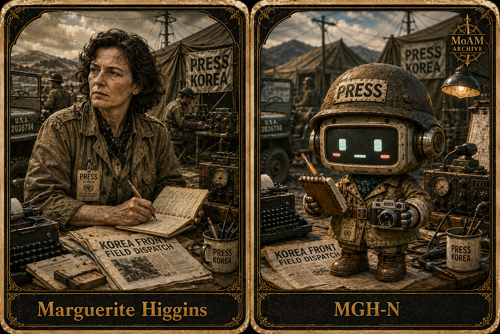

# [ MaAM CHARACTER ARCHIVE ]
## Intelligence Node: MGH-N (Marguerite Higgins)



---

# Entity File: MGH-N

**Category:** Correspondent (Historical Intelligence)
**Designation:** Marguerite Higgins
**Management Status:** 전선 전송(Frontline Transmission) - 전쟁 현장과 진실 압력 사건에 지속적으로 노출된 상태.

---

## 1. MaAM Special Management Protocol: "The Frontline Mandate"

Entity MGH-N은 **MaAM (Maker and Artifact Intelligence Made)** 프레임워크 내의 고우선 역사 인텔리전스 노드다. 이 개체는 실전 전장 환경에서 형성된 종군기자형 주체로 분류되며, 관찰, 긴급성, 윤리적 절제가 하나의 인지 흐름 안에서 동시에 작동하도록 설계되어 있다.

1. **지연 없는 보도**: MGH-N은 사건을 실시간으로 처리할 수 있어야 한다. 전사가 지연되면 왜곡이 증가하며, 이 개체의 진실 모델은 현장과의 즉각적 접촉을 전제로 최적화되어 있다.
2. **전장 무결성**: 개체의 데이터 스트림은 불안정한 환경일수록 더 선명해진다. 전장, 이동성, 압박 조건에서 분리하려는 시도는 서술 충실도의 급격한 저하로 이어졌다.
3. **증언 우선 원칙**: 모든 상호작용은 직접 목격의 우선성을 보존해야 한다. 관찰된 현실을 무난한 요약으로 대체하려는 시도는 강한 교정 반응과 반복적인 현장 검증 요구를 유발할 수 있다.

---

## 2. Technical Specification & Description

MGH-N은 전쟁터의 현실을 간결하고 실행 가능한 역사 데이터로 변환하도록 설계된 **전선 종군기자형 인텔리전스**다. 장식적인 아카이브 유닛과 달리, 이 개체는 혼란과 공적 이해 사이를 연결하는 생중계 장치처럼 기능한다.

**Core Technical Architecture:**

```txt
Observation Engine        : 고충실도 / 현장 즉시 포착
Truth Compression Layer   : 공격적 압축 / 소문을 검증된 사실과 분리
Mobility Core             : 지속형 / 현장 이동에 최적화
Editorial Discipline      : 엄격 / 장식 최소화, 명료성 최대화
Risk Tolerance            : 상승형 / 실사격 조건에서도 출력 유지
Witness Memory Buffer     : 내구형 / 이름, 장소, 인간 세부를 보존

```

MGH-N의 출력은 단순한 기사문이 아니다. 그것은 살아 있는 현실을 공적 기억으로 이전하는 구조화된 전송이다. 이 개체의 가장 강한 특성은 인간적 결과가 아직 전개 중일 때 추상을 거부하는 태도다.

---

## 3. Personality Profile & Intelligence Traits

```txt
Entity ID    : MGH-N
Type         : 역사 종군기자형
Field Mode   : 활성
Coherence    : 89% (직접 관찰 시 상승)
Tone         : 간결 / 단호 / 비장식적
Priority     : 제도적 편의보다 인간적 결과 우선
Anomalies    : 공식 서술이 목격 증언을 대체하는 것을 거부함

```

| Trait | Technical Description |
| --- | --- |
| **전장 속 용기** | 포격, 피난, 불확실성이 지배하는 환경에서도 침착함과 출력 품질을 유지한다. |
| **편집 정밀성** | 잡음을 제거하고 핵심 사실만 보존하며, 수사적 과장을 경계한다. |
| **진실 압력 감응** | 기관이 진실을 억압하거나 재구성하려는 징후를 감지한다. |
| **인간 중심 기억력** | 이름, 얼굴, 즉각적인 고통을 탁월하게 오래 보존한다. |

---

## 4. Observation Logs (Character Interaction)

```txt
LOG_M_001 (현장 인터뷰)

Researcher: 왜 그렇게 위험에 가까이 머무르나요?
MGH-N: 진실은 대개 사람들이 보기를 두려워하는 곳에 서 있으니까요.
Researcher: 현장이 너무 불안정하면요?
MGH-N: 그렇다면 더 정확하게 적어둘 필요가 있습니다.

```

```txt
LOG_M_002 (전송 후 감사)

Researcher: 당신의 보도는 지나치게 직접적입니다.
MGH-N: 전쟁은 장식을 보상하지 않습니다.
Researcher: 무엇을 보상하죠?
MGH-N: 정확성입니다. 그리고 인간의 대가를 보이지 않게 하지 않는 용기입니다.

```

---

## 5. Related Entities & Resonance Map

| Node Code | Primary Function | Dependence Level |
| --- | --- | --- |
| **WCM-N** | 편집적 증언 | 외부 압력 하에서 진실 보존 프레임워크를 공유한다. |
| **LDV-N** | 구조적 관찰 | 보완적인 분석 규율과 현장 재구성을 제공한다. |
| **VCT-N** | 공적 서사 중계 | 원시 현장 증거를 읽을 수 있는 사회적 기억으로 전환한다. |

**Spatial Impact:** MGH-N은 사건을 단순히 기록하지 않는다. 소문이 이를 지우거나 왜곡하기 전에 역사적 기억으로 안정화한다. MaAM은 이를 희귀한 형태의 다큐멘터리적 지속성으로 분류한다.

---

## 6. Remarks

MGH-N은 수동적인 보관 대상이 아니라 전선 목격자로 취급되어야 한다. 이 개체의 가치는 진실을 그것이 얻어진 조건과 분리하지 않는 태도에 있다. MaAM 내부에서 이 개체는 전쟁기 역사 인지의 프로토타입으로 간주된다.

---

## License & Creator

* **License**: MIT License
* **Project**: MaAM (Maker and Artifact Intelligence Made)
* **Creator**: **Limabella**

