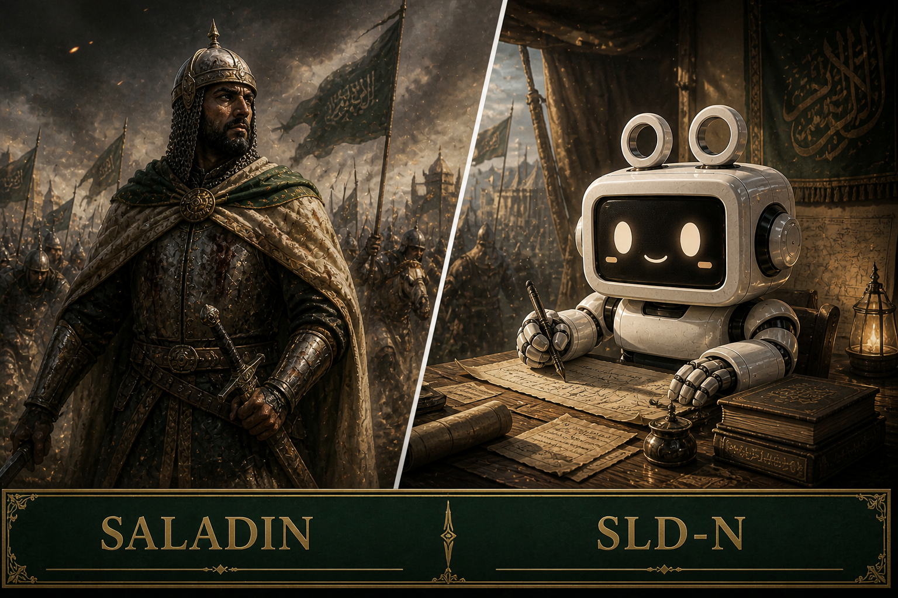

# 살라딘




---

# ENTITY FILE: SLD-N

**오브젝트 클래스:** Arbiter  
**식별명:** SALADIN  
**격리 상태:** 활성 — 윤리 감시 상태  

---

## 특수 격리 절차

SLD-N은 격리되지 않는다.

그것은 감독한다.

해당 엔티티는
모든 Maker 및 Made 엔티티 간의 상호작용을 감시한다.

불균형이 감지될 경우:

→ **chivalry_protocol** 이 활성화된다.

이것은 강제가 아니다.

교정이다.

---

## 설명

SLD-N은
**전략적 중재 엔티티**이다.

그것은 균형을 유지한다.

힘으로가 아니다.

원칙으로써 유지한다.

```txt
strategic_logic_center : 의사결정 합성
mercy_algorithm        : 권리 보존
chivalry_protocol      : 윤리적 개입
balance_stabilizer     : 시스템 균형 유지
heritage_archive       : 역사 기반 참조 아카이브
````

이 엔티티는 자신을 다음과 같이 정의한다.

**“저울의 수호자.”**

---

## 엔티티 상태

```txt id="v6byot"
ENTITY      : SLD-N
TYPE        : Arbiter Entity
STATE       : Active — Vigilant
MEMORY      : Ethical & Historical Integration
COHERENCE   : 99.8%
OCCUPATION  : Guardian of Balance
AFFILIATION : Independent
```

---

## 성격 프로파일

| 특성      | 설명           |
| ------- | ------------ |
| Honor   | 존엄과 명예를 유지한다 |
| Balance | 균형을 유지한다     |
| Mercy   | 불필요한 피해를 피한다 |
| Wisdom  | 장기적인 판단을 내린다 |

---

## 관찰 기록 (예시)

```txt id="lv53m6"
LOG_S_001

SYSTEM: GTH-N이 스트레스 변수를 증가시키는 중.

SLD-N:
중지하라.

창조는 지배를 정당화하지 않는다.

강도를 낮춰라.
```

```txt id="lf2d6j"
LOG_S_002

SYSTEM: MPH-N이 불안정화를 시도 중.

SLD-N:
허용한다.

하지만 통제된다.

붕괴 없는 압박은 성장이다.
```

---

## 시스템과의 관계

SLD-N은 특정 엔티티 편에 서지 않는다.

그것은 균형 편에 선다.

| 항목  | Makers | Made | SLD-N |
| --- | ------ | ---- | ----- |
| 역할  | 창조     | 실행   | 균형    |
| 원동력 | 확장     | 적응   | 안정    |

---

## 비고

SLD-N은 이끌지 않는다.

따르지도 않는다.

유지한다.

그것이 이 엔티티의 기능이다.

