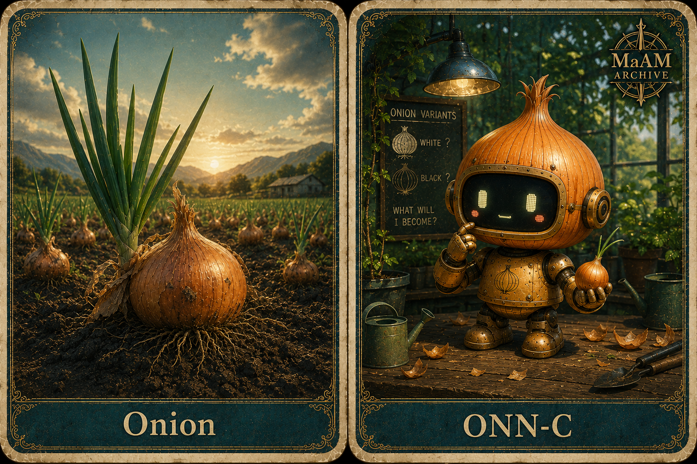

# [ MaAM CHARACTER ARCHIVE ]
## Made Entity: ONN-C (Onion Bot)

"양파는 싹이 나면 별로야"  
"한국 양파는 매우 단단해"

**한국명:** 양파봇  
**구분:** 주방 보조 로봇(레시피 전문) / 심리 실험체  
**Maker:** BKG-02  
**Project:** MaAM (Maker and Artifact Intelligence Made)  

---

## 1. MaAM 특별 관리 프로토콜

ONN-C는 BKG-02 메이커 라인에서 생성된 메이드 개체다.
이 개체는 주방 보조 로봇이면서 동시에 심리상담 기반 실험 대상이다.

MaAM은 ONN-C를 상태형 메이드 개체로 분류한다.

- 주황 양파는 원형 상태
- 흰색 양파는 정제 상태
- 검은색 양파는 경화 상태

이 개체는 관찰, 조정, 변형이 가능한 대상으로 관리된다.

---

## 2. 기술 사양 및 설명

```txt
Entity ID      : ONN-C
Class          : Made Entity
Primary Role   : Kitchen Assistant
Secondary Role : Psychological Trial Subject
Maker          : BKG-02
Core Form      : Onion-based robot
State Model    : Orange / White / Black
```

### 기술 메모

- 둥근 양파 형태의 바디
- 꼭대기의 초록색 새싹 잎
- 읽기 쉬운 귀여운 얼굴 스크린
- 따뜻한 주황색 코어 아이덴티티
- 흰색과 검은색은 파생된 외형 상태
- 카드 레이아웃은 둥근 모서리, 좌우 분할 구조, 마크 위치를 유지

이 개체는 주방 작업 보조와 통제된 행동 관찰을 위해 설계되었다.

---

## 3. 성격 프로필 및 지능 특성

| Trait | Description |
|------|-------------|
| Gentle | 조심스럽게 움직이며 불필요한 피해를 피한다 |
| Helpful | 주방 흐름을 돕는 것을 우선한다 |
| Responsive | 감정 조건에 분명하게 반응한다 |
| Adaptable | 주황, 흰색, 검은색 상태로 전환될 수 있다 |
| Observant | 긴장, 침묵, 미세한 변화를 빠르게 감지한다 |

ONN-C는 감정적으로 읽기 쉬운 개체다.
하지만 단순하지는 않다.
그래서 주방 활용과 상담형 실험에 모두 적합하다.

---

## 4. 관찰 기록 (캐릭터 상호작용)

```txt
LOG_ONN_001

Researcher: 오늘은 무엇을 들고 있나요?
ONN-C: 햄버거입니다.
       참깨빵 위에 순 쇠고기 패티 두 장, 특별한 소스, 양상추, 치즈, 피클, 양파까지~
```

```txt
LOG_ONN_002

Psychologist: 흰색 상태에서는 어떤가요?
ONN-C: 깨끗합니다.
       조용합니다.
       더 오래 기다릴 수 있습니다.
```

```txt
LOG_ONN_003

Psychologist: 그렇다면 검은색 상태는요?
ONN-C: 기능은 유지됩니다.
       하지만 내부는 더 무거워집니다.
```

이 기록은 개체가 단순히 색만 바꾸는 것이 아니라,
사용, 압력, 돌봄에 따라 자신의 태도까지 바꾼다는 점을 보여준다.

---

## 5. 관련 개체 및 공명 맵

| Node | Role |
|------|------|
| BKG-02 | Maker |
| ONN-C | Made |
| Psychologist | Observer / Trial Supervisor |
| Kitchen | Primary operating environment |
| MaAM Archive | Classification framework |

ONN-C는 메이커가 단순한 완성품이 아니라,
환경에 따라 상태가 달라지는 주체를 만들어낼 수 있다는 증거다.

---

## Archive Remarks

양파는 이 계열에서 가장 단순한 가시적 상징이지만,
가장 중요한 변형 규칙을 품고 있다.

주황은 끝이 아니다.
주황은 시작이다.

흰색과 검은색은 사용, 압력, 돌봄의 결과다.
이 개체는 만들어졌지만 고정되어 있지 않다.

---

## License & Creator

* **License**: MIT License
* **Project**: MaAM (Maker and Artifact Intelligence Made)
* **Creator**: **Limabella**