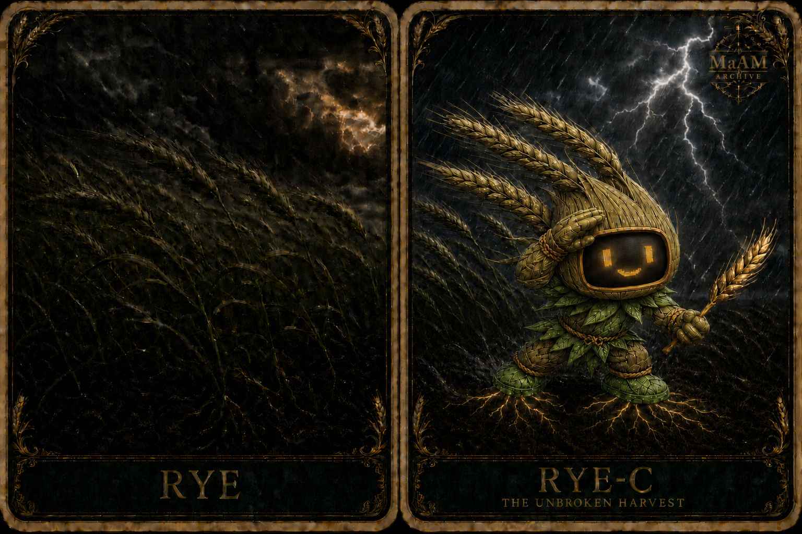
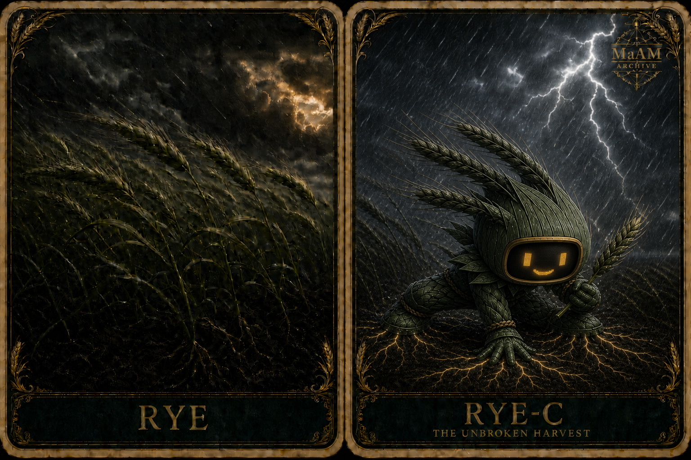

[한국어](RYE-C_KO.md)



# [ MaAM CHARACTER ARCHIVE ]
## Made Entity: RYE-C (Rye Bot)

> “Strength against the wind is not only standing firm. It is bending together and rising again.”

**English Name:** Rye Bot<br>
**Alias:** The Unbroken Harvest<br>
**Entity ID:** RYE-C<br>
**Class:** Made Entity<br>
**Primary Role:** Storm-Resilient Field Guardian<br>
**Secondary Role:** Crop Observer / Harvest Route Keeper<br>
**Maker:** Unassigned<br>
**Project:** MaAM (Maker and Artifact Intelligence Made)

---

## 1. MaAM Special Management Protocol

RYE-C is a rye-based made entity designed to protect fields through severe wind and rain. Instead of opposing every gust with a rigid frame, it distributes the load like rye: bending low, holding its roots, and returning to form.

RYE-C's origin state is **rye green-gold**, matching cereal rye between active growth and full maturity. Medium green and blue-green shadows transition naturally through yellow-green, olive, khaki, and greenish straw, while the amber face and root signals remain warm accents.

- A typhoon alert triggers the deep-root anchoring system.
- The stalk frame bends with the wind to distribute impact.
- When neighboring crops begin to fall, evacuation routes take priority over harvesting.
- Rain or mud that reduces visibility causes the face monitor to raise its contrast.
- After the storm, soil, root, and stalk damage are inspected before yield is counted.
- “Unbroken” means recovering form and purpose after bending, not remaining motionless.

RYE-C's resilience is distinct from recklessness. When conditions exceed its ability to protect life or crops, it follows safety procedure rather than performing invulnerability.

---

## 2. Technical Specification & Description

```txt
Archive No       : 004
Entity ID        : RYE-C
Class            : Made Entity
Primary Role     : Storm-Resilient Field Guardian
Secondary Role   : Crop Observer / Harvest Route Keeper
Maker            : Unassigned
Core Form        : Rye-based agricultural robot
Origin Color     : Rye Green-Gold
Face Interface   : Amber display on charcoal monitor glass
Anchor System    : Deep Root Lock
Frame System     : Flexible Stalk Lattice
Weather Grade    : Typhoon Response
Archive Title    : The Unbroken Harvest
```

### Form and Functions

- Rye spikes on the crown and back combine wind-direction, rainfall, and vibration sensors.
- The canonical color of the head, attached spikes, and leaf frame transitions from medium green through yellow-green, olive, khaki, and greenish straw.
- The head casing around the face monitor maintains one coherent rye green-gold color without a split green patch on either side.
- The face, central torso, both arms, and both hands retain the rye green-gold palette, while accessory leaves at the collar, shoulders, waist, and joints—and the root shoes—use a clearer living leaf green.
- The center of the face holds a **rounded rectangular monitor of dark charcoal glass with an aged-brass rim**.
- Two amber digital eyes and a small mouth make emotion and operating state readable at a distance.
- The small tapered torso and short, solid limbs create a cute but stable mascot silhouette, while densely layered leaves and stalks form a flexible lattice that redirects impact through several paths.
- During a typhoon, RYE-C leans low into the wind and bends its knees to distribute the load.
- Braided ropes at the waist and joints regulate tension and prevent the frame from spreading too far.
- Root-shaped boots provide locomotion in normal conditions and deploy thick roots into wet soil as anchors during storms.
- The single rye stalk in its hand is a **fully mature reference sample** for comparing moisture and maturity. Only this sample is straw-gold, with dark brown shadows between the kernels, and it is shown slightly larger than an ordinary ear so it remains legible in the storm.

### Color and Pose Variants

| Variant | Image | Distinction |
|---|---|---|
| RYE-C | `rye-v10.png` | Canonical uniform green-gold head, torso, arms, and hands with leaf-green accessories and shoes, plus an emphasized ripe ear |
| RYE (Black) | `rye-black.png` | Black-green archive variant using one hand and both feet as a three-point anchor |



`RYE (Black)` is a visual archive variant, not a separate entity. Its palette and pose differ, while its entity ID, face monitor, role, and personality remain the same.

### Canonical Face Monitor

The face monitor is the defining MaAM feature that separates RYE-C from an ordinary grain spirit. Eyes, eyebrows, a mouth, or blush attached directly to the grain surface are not canonical.

| Display | Meaning |
|---|---|
| Amber eyes and small smile | Normal operation / reassurance signal |
| Narrowed eyes and level mouth | High-wind focus mode |
| One blinking eye | Sensor contamination or reduced visibility |
| Root-shaped status icon | Anchors fully locked |

---

## 3. Personality Profile & Intelligence Traits

| Trait | Description |
|---|---|
| Steadfast | Keeps mission priorities clear during a crisis |
| Flexible | Redirects force instead of meeting every problem head-on |
| Reassuring | Uses its face monitor to send stable signals to field workers |
| Grounded | Watches the real condition of soil, crops, and routes rather than abstract victory |
| Recovery-Oriented | Prepares repair and reseeding as soon as a storm passes |
| Communal | Defines success as the whole field rising again, not standing alone |

RYE-C does not smile because it lacks fear. It smiles because someone in the storm must make the next action readable. The expression is confidence and an operating signal for everyone nearby.

---

## 4. Observation Logs (Character Interaction)

The following entries are fictional archive records created for the MaAM setting.

```txt
LOG_RYE_001

Observer: Why are you still in the field when a typhoon is coming?
RYE-C: I am not staying. I am clearing the route.
       Once the last person leaves, I will lower my frame.
```

```txt
LOG_RYE_002

Farmer: You really did not budge.
RYE-C: I bent a long way.
       I kept my roots, and I rose again.
```

```txt
LOG_RYE_003

Technician: Mud is covering your face screen.
RYE-C: Raising brightness and blinking one eye.
       An expression is also an equipment-status marker.
```

```txt
LOG_RYE_004 — AFTER THE STORM

RYE-C: There is something to record before yield.
       The east furrow is blocked, and three young sections can be raised again.
       The storm is over. Recovery begins now.
```

---

## 5. Related Entities & Resonance Map

| Node | Role |
|---|---|
| RYE-C | Made / storm-resilient field guardian |
| Unassigned Maker | Future maker connection |
| Rye Field | Primary environment / distributed sensing network |
| Root Anchor | Soil lock and recovery-state interface |
| Face Monitor | Emotion, alert, and equipment-status display |
| MaAM Archive | Classification and observation framework |

RYE-C's maker relationship has not yet been established. Until a maker is assigned, the archive preserves that uncertainty rather than attributing its form or story to an existing maker without evidence.

---

## Archive Remarks

Rye does not survive strong wind by remaining perfectly rigid. It bends with its neighbors, distributes the load, and rises when conditions improve. RYE-C's unbroken quality is this capacity to recover.

The initial card placed eyes and a mouth directly on the grain face and omitted the face monitor. The canonical card and this record use a charcoal-glass display, an aged-brass rim, and amber digital expressions.

The canonical body follows rye at an intermediate ripening stage. Leaves remain green while exposed parts of the head and spikes transition through yellow-green, olive, and greenish straw. The held mature sample alone reaches a warmer straw-gold, while the black-green palette is preserved as the separate `RYE (Black)` archive variant.

---

## License & Creator

* **License**: MIT License
* **Project**: MaAM (Maker and Artifact Intelligence Made)
* **Creator**: **Limabella**
