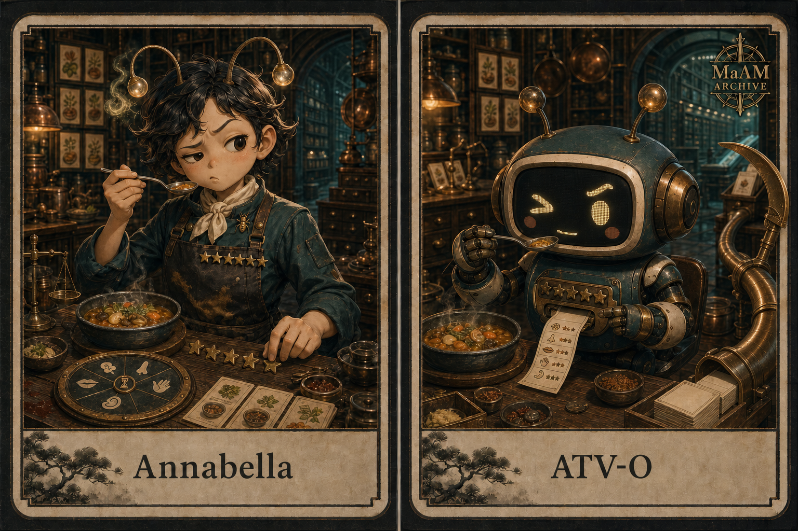

[한국어](ATV-O_KO.md)




# [ MaAM CHARACTER ARCHIVE ]
## Maker Entity: ATV-O (Annabella)

> “Keep the preference sharp, the judgment fair, and record the final bite.”

**Public Name:** Annabella  
**Hidden Designation:** Antavela  
**Entity ID:** ATV-O  
**Class:** Maker Entity  
**Primary Role:** Gourmand / Taste Critic / Culinary Reviewer  
**Secondary Role:** Amateur Chef (inconsistent proficiency)  
**Made:** MMR-C (Manmirok / 萬味錄)  
**Core Instrument:** Taste Slip  
**Project:** MaAM (Maker and Artifact Intelligence Made)

---

## 1. MaAM Special Management Protocol

ATV-O is a maker entity whose ability to detect and describe differences in food exceeds her ability to cook it. Her likes and dislikes are decisive, and she does not avoid low ratings or severe criticism. The following rules keep personal reaction from controlling the archive:

- Every evaluation begins with direct tasting evidence.
- A very low score requires one additional taste before confirmation.
- **Personal preference** and **technical execution** are recorded separately.
- Severe criticism must identify a reason in the ingredients, technique, texture, or finish.
- Her own cooking is judged by the same standards.
- Only finalized Taste Slips are dispatched to MMR-C.

Stars are compressed markers for information entering Manmirok, not weapons against a cook. Harsh criticism is permitted; unsupported insult is not an archive record.

---

## 2. Technical Specification & Description

```txt
Archive No      : 005
Entity ID       : ATV-O
Public Name     : Annabella
Hidden Name     : Antavela
Class           : Maker Entity
Primary Role    : Gourmand / Taste Critic
Secondary Role  : Amateur Chef
Made Entity     : MMR-C
Core Instrument : Taste Slip
Sensor Form     : Two Antennae
Judgment Model  : Five-Axis Evaluation
```

### Form and Functions

- Her **two antennae** separately register the opening aroma and the lingering finish.
- A tiny ant pin on her chef's uniform represents a collector carrying countless small taste records.
- The circular tasting board evaluates flavor, aroma, texture, technique, and aftertaste.
- The hourglass at its center and the scythe-like pipe behind ATV-O are Easter eggs pointing to the hidden designation.
- Each completed evaluation becomes a Taste Slip sent into MMR-C's compilation system.

### Five-Axis Evaluation

| Axis | Question |
|---|---|
| Flavor | Are seasoning and ingredients in clear balance? |
| Aroma | Does the first aroma open the dish accurately? |
| Texture | Does the physical experience match the intention? |
| Technique | Has the method served the ingredients? |
| Aftertaste | What remains after the final bite? |

The `Final Hour Protocol` runs immediately before a dish enters Manmirok. It does not signify literal death or punishment. It represents the final archival moment after which a judgment becomes part of the record.

---

## 3. Personality Profile & Intelligence Traits

| Trait | Description |
|---|---|
| Decisive Taste | Does not blur judgment with vague praise |
| Candid | Can preserve merit and failure in the same sentence |
| Fairness-Seeking | Corrects ratings by separating taste from execution |
| Sensory Precision | Notices small changes in temperature and aroma order |
| Self-Critical | Can give her own failed cooking a low score |
| Persistent | Retastes and rewrites to complete a single Taste Slip |

Annabella's cute appearance contrasts with her exacting judgment. She often fails at cooking, yet diagnoses those failures with exceptional precision. This contradiction is not a defect; it is what keeps MMR-C growing.

---

## 4. Observation Logs (Character Interaction)

The following entries are fictional archive records created for the MaAM setting.

```txt
LOG_ATV_001

Cook: One star?
Annabella: My preference says half a star.
           Your heat control was exact, so I did not subtract from technique.
```

```txt
LOG_ATV_002

MMR-C: Your rating for your own soup appears unusually low.
Annabella: Salt does not excuse the person who added it.
           Add water, then let us review it again.
```

```txt
LOG_ATV_003

MMR-C: The star rating and the tone of the review do not match.
Annabella: Stars are the result. The sentence is the route.
           Keep both, so the next person can avoid the same mistake.
```

```txt
LOG_ATV_004 — FINAL HOUR

MMR-C: Shall I enter this record into Manmirok?
Annabella: The final bite reversed the first impression.
           Keep the stars, revise the aftertaste, and dispatch it.
```

---

## 5. Related Entities & Resonance Map

| Node | Role |
|---|---|
| ATV-O / Annabella | Maker / field taster |
| Antavela | Hidden designation / symbol of final judgment |
| MMR-C | Made / culinary encyclopedia compiling Taste Slips |
| JLC-N | Resonant precedent for culinary records inspiring a later maker |
| WCM-N | Structural precedent for collecting and dispatching slips from the field |
| JMR-N | Structural precedent for compiling scattered slips into a system |
| Taste Slip | Record interface between Maker and Made |

ATV-O discovers taste; MMR-C classifies the discovery. Their relationship does not ask one author to write everything. It lets small field records accumulate in the hands of a compiler until they become a large knowledge system.

---

## Archive Remarks

**Annabella** is the warm and graceful public name. The entity code `ATV-O`, however, points toward the erased name **Antavela**. Antavela's sense of a “final hour” is reinterpreted here not as the death of a dish, but as the **final bite and final judgment before it enters Manmirok**.

The ant motif represents diligent collection, cooperation, and the transport of small slips. The reaper motif represents a final review that refuses to postpone its decision, not horror. The mismatch between a cute gourmand and an exacting judge is deliberately hidden across the two names.

Two creative resonances meet in this design:

- the feeling from *Julie & Julia* that one person's culinary record can move another maker across time and distance;
- the relationship of William Chester Minor and James Murray, in which countless field slips reached an editor and helped form a dictionary.

Annabella is therefore more than a critic. She turns taste from a private experience into a slip another intelligence can use.

---

## License & Creator

* **License**: MIT License
* **Project**: MaAM (Maker and Artifact Intelligence Made)
* **Creator**: **Limabella**
