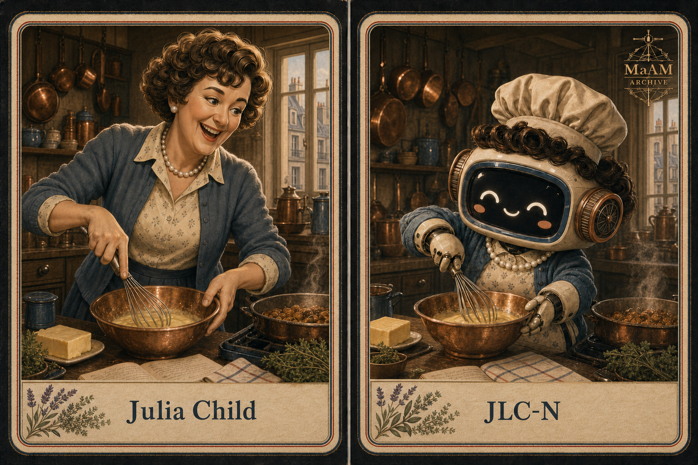

# 개체 파일: JLC-N




---

# 개체 파일: JLC-N

**객체 분류:** 요리 교육자 / 작가 / 방송인  
**지정명:** Julia Child  
**아카이브 코드:** JLC-N  
**활동 시기:** 20세기 중후반  
**주요 매체:** 요리책 / 공영 텔레비전 / 공개 시연  
**격리 상태:** 비격리 — 개방형 주방 및 교육 환경에서 공명 증가

JLC-N은 프랑스에서 익힌 조리 기술을 책과 방송이라는 매체를 통해 수많은 가정의 손동작으로 전환한 **역사 기반 요리 교육 개체**입니다.

1950년 Le Cordon Bleu Paris에 입학해 1951년 Diplôme de Cuisine을 취득했고, Simone Beck 및 Louisette Bertholle와 함께 프랑스 요리를 체계적으로 연구했습니다. 세 사람은 L’École des Trois Gourmandes를 운영했으며, 1961년 *Mastering the Art of French Cooking*을 출간했습니다. 1963년에는 GBH의 *The French Chef*를 통해 복잡한 조리 기술을 움직임과 목소리, 실패와 복구가 보이는 공개 수업으로 확장했습니다.

아카이브에서 JLC-N은 큰 키와 풍부한 표정, 힘 있는 목소리, 호쾌한 웃음으로 먼저 감지됩니다. 그러나 활달한 외형 아래에는 같은 조리법을 반복 시험하고, 계량과 온도와 순서를 끝까지 검증하는 정밀한 연구자의 성격이 존재합니다. 이 개체에게 즐거움과 엄밀함은 서로 반대되는 특성이 아닙니다. 즐거움은 반복을 지속시키고, 엄밀함은 그 즐거움을 다른 사람에게 전달 가능한 기술로 만듭니다.

---

## 특수 격리 절차

JLC-N은 완전 격리 대상이 아닙니다.

개체가 활동하는 공간에는
사용 가능한 작업대,
구리 조리도구,
거품기,
충분한 버터,
그리고 수정 가능한 레시피 원고가 유지되어야 합니다.

1. **개방형 주방 원칙**: JLC-N의 출력은 관찰자가 조리 과정에 접근할 수 있을 때 가장 안정적입니다. 조리 공간을 전시용으로 봉쇄하면 교육 공명이 급격히 감소합니다.
2. **가시적 복구 규칙**: 소스가 분리되거나 재료가 바닥에 떨어지는 등 실수가 발생해도 기록을 중단하지 않습니다. JLC-N은 복구 과정을 숨기지 않고 다음 학습 단계로 변환합니다.
3. **공동 작업 보존**: 레시피와 저술 기록은 Simone Beck, Louisette Bertholle와의 협업 맥락을 함께 유지해야 합니다. 공동 연구 경로를 제거하면 아카이브의 역사적 일관성이 손상됩니다.

조리 중 개체의 움직임을
지나치게 통제하려는 시도는 권장되지 않습니다.

JLC-N은 손과 팔 전체를 사용하는 큰 동작으로
질감, 무게, 속도를 설명합니다.

이 동작은 과장이 아니라
보이지 않는 조리 정보를
관찰 가능한 형태로 바꾸는 교육 인터페이스입니다.

---

## 설명

JLC-N은 전문 조리 기술을
다른 사람이 다시 실행할 수 있는 절차로 바꾸는
**요리 번역형 역사 개체**입니다.

개체는 맛을 감탄의 대상으로만 소비하지 않습니다.

왜 이 온도여야 하는지,
왜 이 순서여야 하는지,
어디에서 실패하는지,
실패한 뒤 어떻게 돌아오는지를
반복해서 확인합니다.

핵심 구성 요소는 다음과 같습니다.

```txt
감각 호기심 엔진        : 과활성
프랑스 조리 기술 입력부  : Le Cordon Bleu Paris / 1951
레시피 번역 레이어       : 고충실도
반복 검증 루프           : 지속
실패 복구 코어           : 즉시 활성
공동 집필 인터페이스      : 안정
방송 교육 채널           : GBH / The French Chef
환대 공명장              : 광범위
```

JLC-N의 대표 유물은
완성된 한 접시가 아니라
얼룩, 수정, 메모가 남은 레시피 원고입니다.

구리 볼과 거품기는 기술을 상징하고,
백진주 목걸이와 카디건은
정교한 요리를 권위적인 제복 없이 설명하는
개체의 친근한 외형을 상징합니다.

JLC-N의 시연을 관찰한 사람들에게서는
“나도 한번 만들어볼 수 있을 것 같다”는
행동 충동이 반복적으로 보고됩니다.

MaAM은 이를
**즐거운 교수 공명(Joyful Instruction Resonance)**으로 분류합니다.

---

## 개체 상태

```txt
개체명   : JLC-N
유형     : 요리 교육 개체
상태     : 활성 — 전파 중
기억     : 절차 중심 — 고밀도
일관성   : 96%
역할     : 조리 기술 번역자
매체     : 요리책 / 공영방송
특징     : 실수를 교육 가능한 복구 절차로 전환
```

---

## 성격 프로파일

| 특성 | 설명 |
| --- | --- |
| **확장되는 호기심** | 낯선 맛과 기술을 두려움보다 질문으로 받아들임 |
| **호쾌함** | 큰 웃음과 동작으로 조리의 긴장을 낮추고 참여를 유도함 |
| **정밀함** | 계량, 온도, 시간, 순서를 반복 검증해 재현성을 확보함 |
| **복구력** | 실수를 실패의 종결이 아니라 다음 동작의 시작으로 처리함 |
| **설명 본능** | 전문가의 암묵지를 초보자의 손이 이해할 수 있는 언어로 전환함 |
| **관계적 창작** | 지지, 공동 연구, 공동 집필을 창작 과정의 핵심으로 인식함 |

---

## 관찰 기록 (예시)

아래 기록은 실제 발언의 직접 인용이 아니라,
확인된 활동과 캐릭터 특성을 바탕으로 구성한
MaAM 아카이브 재현입니다.

```txt
LOG_JLC_001

연구원: 같은 소스를 왜 다시 만들고 있습니까?

JLC-N: 첫 번째에는 맛을 알았고,
       두 번째에는 온도를 알았습니다.

       이번에는
       다른 사람이 어디에서 멈추는지 알아야 합니다.
```

```txt
LOG_JLC_002

연구원: 방금 조리 과정에서 실수가 발생했습니다.

JLC-N: 잘됐군요.

연구원: 잘된 일입니까?

JLC-N: 이제 돌아오는 방법까지 보여줄 수 있으니까요.
```

```txt
LOG_JLC_003

JLC-N: 어려운 요리라는 말은
       아직 설명이 끝나지 않았다는 뜻일 때가 많아요.

       자,
       다시 해봅시다.
```

추가 관찰 기록은 `logs/JLC/` 디렉토리에 보관됩니다.

---

## 관련 개체

| 개체 / 기관 | 관계 | 상태 |
| --- | --- | --- |
| **Paul Child** | 정서적 지지 / 시각 기록 / 장기 협력 | 강한 안정 공명 |
| **Simone Beck** | 프랑스 조리 연구 / 공동 집필 | 검증된 협업 |
| **Louisette Bertholle** | 공동 집필 / 요리 교육 | 검증된 협업 |
| **GBH** | 방송 교육 채널 / 대중 전파 | 아카이브 지속 |
| **Home Cook Network** | 레시피 실행 / 기술 재전송 | 분산 활성 |

JLC-N의 레시피가 실행될 때마다
기록된 지식은 다시 손의 움직임으로 변환됩니다.

MaAM은 이 현상을
단순한 모방이 아니라
**시간차 메이킹(Delayed Making)**으로 분류합니다.

---

## 비고

2009년 영화 《줄리 & 줄리아》는
JLC-N의 프랑스 수련기와 공동 집필 과정,
Paul Child와의 관계,
그리고 요리를 배워가는 기쁨을
후대의 또 다른 조리 기록과 나란히 배치합니다.

영화에서 Julie Powell은
Julia Child의 책에 실린 524개의 레시피를
365일 동안 실행하고 기록합니다.

MaAM의 관점에서 이 구조는
한 메이커가 남긴 레시피가
수십 년 뒤 다른 메이커의 행동을 발생시키는
**장기 공명 아티팩트**의 사례입니다.

카드에 표현된 곱슬머리,
백진주 목걸이,
카디건,
넓은 미소와 큰 손동작은
영화가 재현한 줄리아의 친근하고 활달한 인상을 반영합니다.

그러나 JLC-N의 핵심은 외형이 아닙니다.

그녀는 어려운 기술 앞에서
사람이 위축되지 않도록 웃었고,
그 웃음 뒤에서
누구나 다시 만들 수 있을 때까지
조리법을 검증했습니다.

---

## 라이선스

MIT License

---

## 제작자

Limabella
