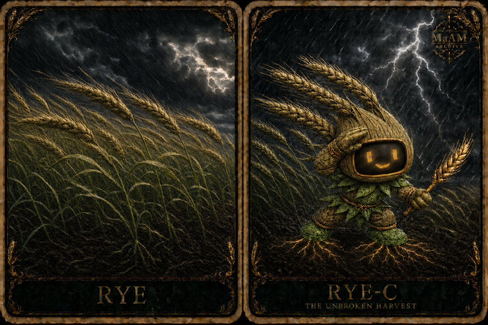
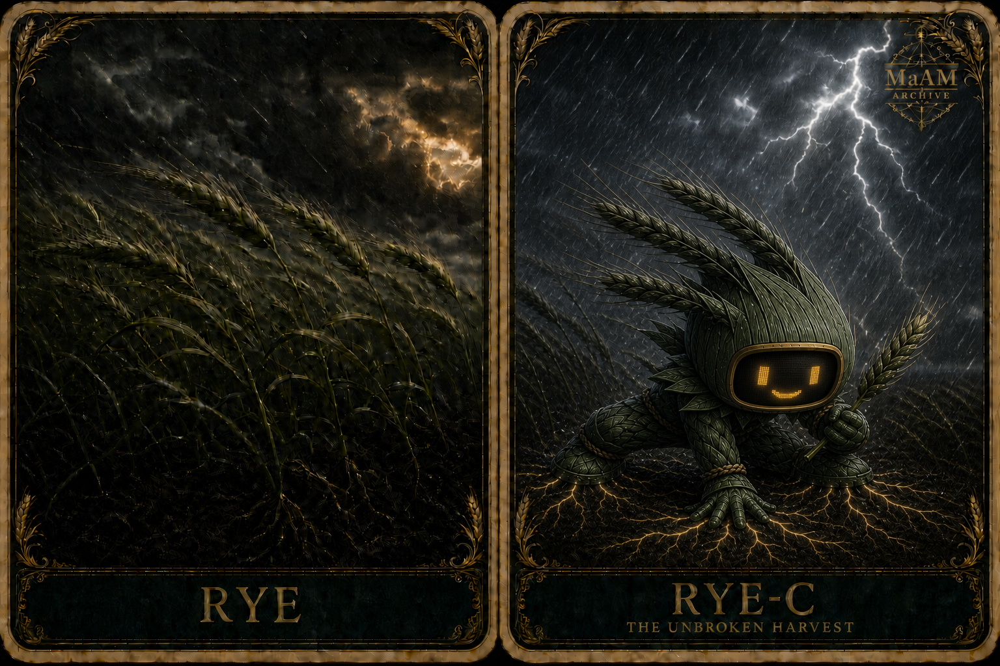

[English](README.md)



# [ MaAM CHARACTER ARCHIVE ]
## Made Entity: RYE-C (호밀봇)

> “바람을 이기는 건 버티는 힘만이 아니야. 함께 숙이고, 다시 일어서는 힘이지.”

**한국명:** 호밀봇<br>
**별칭:** 꺾이지 않는 수확 (The Unbroken Harvest)<br>
**개체 ID:** RYE-C<br>
**구분:** Made Entity<br>
**주요 역할:** 태풍 대응형 농경 수호자<br>
**부차 역할:** 작물 상태 관측 / 수확 경로 확보<br>
**Maker:** 미지정<br>
**Project:** MaAM (Maker and Artifact Intelligence Made)

---

## 1. MaAM 특별 관리 프로토콜

RYE-C는 강풍과 폭우 속에서도 밭을 지키도록 설계된 호밀 기반 메이드 개체다. 단단히 고정된 채 바람과 맞서는 대신, 호밀처럼 하중을 나누어 받고 몸을 숙인 뒤 원래 자세로 돌아온다.

RYE-C의 원형 상태는 성장과 성숙 사이의 호밀을 닮은 **푸른 누런 호밀색**이다. 잎의 중간 녹색과 청록빛 그림자 위로 연두, 올리브, 카키, 녹색 볏짚빛이 자연스럽게 이어지며, 호박빛 얼굴과 뿌리 신호가 따뜻한 강조색으로 남는다.

- 태풍 경보가 발령되면 뿌리 앵커를 토양 깊이에 고정한다.
- 줄기 프레임은 바람의 방향에 맞춰 휘어 충격을 분산한다.
- 주변 작물이 쓰러지기 시작하면 수확보다 대피 경로 확보를 우선한다.
- 시야를 가리는 비나 진흙이 감지되면 얼굴 모니터의 대비를 높인다.
- 폭풍이 지난 뒤에는 토양, 뿌리, 줄기 손상을 먼저 점검한다.
- “끄떡없음”은 움직이지 않는다는 뜻이 아니라, 휘어진 뒤에도 임무와 형태를 회복한다는 뜻이다.

RYE-C의 강인함은 무모함과 구분된다. 생명과 작물을 지킬 수 없는 수준의 위험에서는 버티는 모습을 연출하지 않고 안전 절차를 따른다.

---

## 2. 기술 사양 및 개체 설명

```txt
Archive No       : 004
Entity ID        : RYE-C
Class            : Made Entity
Primary Role     : Storm-Resilient Field Guardian
Secondary Role   : Crop Observer / Harvest Route Keeper
Maker            : Unassigned
Core Form        : Rye-based agricultural robot
Origin Color     : Rye Green-Gold
Face Interface   : Amber display on charcoal monitor glass
Anchor System    : Deep Root Lock
Frame System     : Flexible Stalk Lattice
Weather Grade    : Typhoon Response
Archive Title    : The Unbroken Harvest
```

### 외형 및 기능

- 머리와 등 뒤의 호밀 이삭은 풍향, 강우량, 진동을 감지하는 복합 센서다.
- 머리, 머리에 붙은 이삭, 잎 프레임의 본연색은 중간 녹색에서 연두·올리브·카키·녹색 볏짚빛으로 이어지는 푸른 누런 호밀색이다.
- 얼굴 모니터를 감싼 머리 껍질은 좌우 색이 갈라지지 않는 균일한 푸른 누런 호밀색으로 유지한다.
- 얼굴·중심 몸통·양팔·양손은 푸른 누런 호밀색을 유지하고, 목깃·어깨·허리·관절의 장식 잎과 뿌리 신발만 한 단계 선명한 잎녹색으로 구분한다.
- 얼굴 중앙에는 **짙은 숯빛 유리와 황동 테두리로 된 둥근 직사각형 모니터**가 있다.
- 얼굴 모니터에는 두 개의 호박빛 디지털 눈과 작은 입이 표시되어 감정과 상태를 멀리서도 읽을 수 있다.
- 작은 역삼각형 몸통과 짧고 단단한 팔다리는 귀여우면서도 안정적인 마스코트 비율을 이루며, 촘촘히 겹친 잎과 줄기는 충격을 여러 방향으로 흘려보내는 유연한 격자 프레임이다.
- 태풍 속에서는 몸을 바람 쪽으로 낮게 기울이고 무릎을 굽혀 하중을 분산한다.
- 허리와 관절의 꼬임 밧줄은 프레임이 과도하게 벌어지는 것을 막는 장력 조절 장치다.
- 뿌리 모양 장화는 평상시에는 이동 장치로, 폭풍 시에는 발밑에서 굵은 뿌리를 펼쳐 젖은 토양을 붙잡는 앵커로 전환된다.
- 손에 든 호밀 한 줄기는 주변 작물의 수분과 성숙도를 비교하는 **완숙 기준 표본**이다. 이 표본만 볏짚빛 황금갈색이며, 낟알 사이에 짙은 갈색 음영이 나타난다. 폭풍 속에서도 식별되도록 일반 이삭보다 조금 크게 표현한다.

### 색상 및 자세 변형

| 변형 | 이미지 | 구분 |
|---|---|---|
| RYE-C | `rye-v11.png` | 정식 기본형. 균일한 푸른 누런 머리·몸통·팔·손, 잎녹색 장식·신발, 강조된 완숙 이삭, 녹색·올리브·볏짚빛의 자연스러운 폭풍 호밀밭 |
| RYE (Black) | `rye-black.png` | 흑녹색 아카이브 변형. 한 손과 두 발을 토양에 고정하는 세 점 앵커 자세 |



`RYE (Black)`은 별도 개체가 아니라 RYE-C의 시각 변형 기록이다. 자세와 색은 구분되지만 개체 ID, 얼굴 모니터, 역할, 성격은 동일하다.

### 얼굴 모니터 정식 사양

얼굴 모니터는 RYE-C를 일반적인 곡물 정령과 구분하는 핵심 MaAM 식별 요소다. 눈, 눈썹, 입, 볼이 곡물 표면에 직접 붙어 있는 표현은 정식 사양이 아니다.

| 표시 | 의미 |
|---|---|
| 호박빛 눈과 작은 미소 | 정상 운용 / 안심 신호 |
| 가늘어진 눈과 수평선 입 | 강풍 집중 모드 |
| 점멸하는 한쪽 눈 | 센서 오염 또는 시야 저하 |
| 뿌리 모양 상태 아이콘 | 앵커 고정 완료 |

---

## 3. 성격 프로필 및 지능 특성

| 특성 | 설명 |
|---|---|
| 굳셈 | 위기 속에서도 임무의 우선순위를 잃지 않는다 |
| 유연함 | 정면 충돌보다 휘어 흘려보내는 해결법을 택한다 |
| 낙관적 | 얼굴 모니터로 주변 작업자에게 안정 신호를 보낸다 |
| 현장 중심 | 추상적인 승리보다 토양, 작물, 통로의 실제 상태를 본다 |
| 회복 지향 | 폭풍을 견딘 뒤 가장 먼저 복구와 재파종을 준비한다 |
| 공동체적 | 홀로 서는 것보다 밭 전체가 다시 일어서는 것을 성공으로 본다 |

RYE-C는 겁이 없어서 웃는 것이 아니다. 누군가는 폭풍 속에서도 다음 행동을 알아야 하기에 웃는다. 그 미소는 자신감인 동시에 주변을 위한 운용 신호다.

---

## 4. 관찰 기록 (캐릭터 상호작용)

아래 내용은 MaAM 세계관을 위한 가상 아카이브 기록이다.

```txt
LOG_RYE_001

Observer: 태풍이 오는데 왜 밭에 남아 있나요?
RYE-C: 남아 있는 게 아니라 길을 열고 있어요.
       마지막 사람이 나가면 저도 낮게 숙일 겁니다.
```

```txt
LOG_RYE_002

Farmer: 정말 끄떡없었구나.
RYE-C: 많이 휘었어요.
       하지만 뿌리를 놓지 않았고, 다시 일어났습니다.
```

```txt
LOG_RYE_003

Technician: 얼굴 화면이 진흙으로 가려졌습니다.
RYE-C: 밝기를 올리고 한쪽 눈을 점멸하겠습니다.
       표정도 장비 상태를 알려 주는 표지니까요.
```

```txt
LOG_RYE_004 — AFTER THE STORM

RYE-C: 수확량보다 먼저 기록할 것이 있습니다.
       동쪽 고랑은 막혔고, 어린 줄기 세 구역은 다시 세울 수 있어요.
       폭풍이 끝났으니 이제 회복을 시작하죠.
```

---

## 5. 관련 개체 및 공명 지도

| Node | Role |
|---|---|
| RYE-C | Made / 태풍 대응형 농경 수호자 |
| Maker 미지정 | 향후 연결할 제작 개체 |
| Rye Field | 주 운용 환경 / 분산 감지망 |
| Root Anchor | 토양 고정 및 회복 상태 인터페이스 |
| Face Monitor | 감정·경보·장비 상태 표시 장치 |
| MaAM Archive | 개체 분류 및 관찰 체계 |

RYE-C의 Maker 관계는 아직 확정되지 않았다. 새로운 Maker가 지정되기 전까지 이 항목은 미지정 상태로 유지하며, 외형이나 서사를 근거 없이 기존 Maker에게 귀속하지 않는다.

---

## Archive Remarks

호밀은 강한 바람 앞에서 완전히 꼿꼿한 식물이 아니다. 함께 휘고, 하중을 나누고, 조건이 나아지면 다시 선다. RYE-C의 “꺾이지 않음”도 바로 그 회복의 방식이다.

초기 카드에는 눈과 입이 곡물 얼굴에 직접 표현되어 얼굴 모니터가 빠져 있었다. 정식 카드와 본 문서에서는 숯빛 유리, 황동 테두리, 호박빛 디지털 표정을 갖춘 얼굴 모니터를 사용한다.

기본형은 녹색과 누런색 사이의 중간 숙도 호밀을 따른다. 잎은 녹색을 유지하고 머리와 이삭의 노출부는 연두·올리브·녹색 볏짚빛으로 옮겨 간다. 손에 든 완숙 표본만 더 따뜻한 황금갈색이며, `RYE (Black)`의 흑녹색은 별도 아카이브 변형으로 보존한다.

기본형의 폭풍 호밀밭도 같은 생물학적 변화를 따른다. 줄기와 잎은 차분한 녹색·청록색을 유지하고, 익어 가는 이삭은 연두·올리브·카키·부드러운 볏짚 금빛으로 이어진다. 거의 검은 호밀밭은 `RYE (Black)` 아카이브 변형에만 사용한다.

---

## License & Creator

* **License**: MIT License
* **Project**: MaAM (Maker and Artifact Intelligence Made)
* **Creator**: **Limabella**
